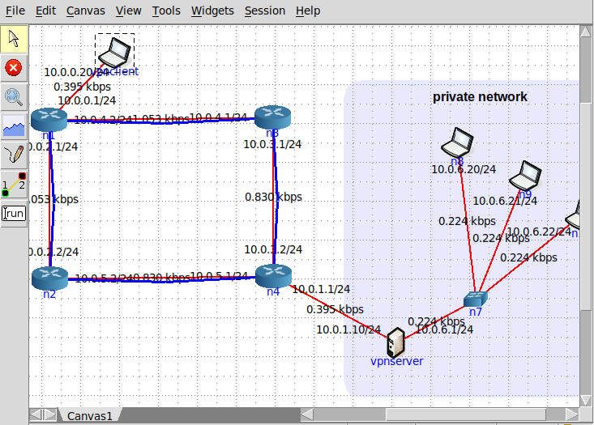
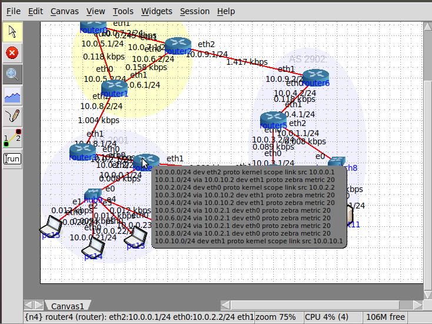

# Assignment 5
heading:: 1
	- I first started this assignment by installing virtual box on my Mac book. Typically, I use Microsoft's Azure platform for these assignments; however,  I wanted to mix things up for this assignment. The installation of virtual box was rather easy. For installation I prefer to use the unofficial MacOS package manager known as Homebrew. This was done through the following command:
		- ```bash
		  brew install virtualbox
		  ```
	- After I successfully brewed up virtualbox, I then began to download the LTS release of Ubuntu known as Bionic Beaver (18.04.6). I grabbed the AMD64 desktop image, as that is what our professor used in the zoom lectures.
	- During the time it took for ubuntu to download, I started work on making a shell script in order to run the required installation commands for core.  After completing this shell script, I then copied the shell script line-by-line and pasted it into hastebin.com. My goal with this was to make a quick and painless way of transferring the shell script once the VM was fully spun up.
	- For the most part, the shell script was very easy to make, as making it consisted of me copying the provided commands into a text file and adding the bash shebang at the top. The only other thing I had  to do was add a line for grabbing the CORE install, which I simply did with the wget command.
	- Spinning up the VM was actually more difficult than I thought, as I am not to familiar with Virtual Box, and am more of an avid Gnome Box user. Turns out, the issue I was having was related to a macOS security feature. I solved this by installing the kernel drivers for virtual box, by default macOS did not want to install these drivers. After a quick restart, virtual box was running smoothly.
	- https://cloud.geno.gg/pW3giY
	-
	- Once the VM was up, I noticed that I was having compatibility issues. My keyboard input was not matching what I was pressing.  This painstakingly took me 2 hours to solve, and it ended up being a security feature of macOS preventing the VM from properly receiving key-input.
	- Finally, at this point I was ready for the fun to began, and so I proceeded to go the hastebin.com to fetch my shell script from earlier. I did this by using wget on the following  URL (https://hastebin.com/raw/imisakixod) and then renamed the file to install-core.sh
	- I than ran sudo -i to switch to the root user, and then ran cd ~obox to get to the directory of my home page. From here I could execute the shell script with out worrying about permissions once I edited the chmod permissions.
	- Attempting to run the daemon led to an issue with python. I was able to fix the issue by grabbing the requirements.txt from CORE's github, and then installing the requirements. However, this did not seem to have all the requirements so I then installed mako and pyproj. This seemed to work, however the daemon's 'start' parameter didn't seem to want to work. To get around this, I ran the dameon with out any parameters but passed it to the background via the bash & operator.  Finally, I was able to run core-gui.
	- At this point I managed to get the daemon to run and the gui to open, however, the path finding algorithms were not working properly. I believe this is because the recommended version of Ubuntu has an outdated verison of python, this is important because the cryptography algorithms are used by core. So I updated python
	- https://cloud.geno.gg/UziaBm
	- ## Core Lab # 1
	  heading:: 2
		- For the first lab, I follow the instructions. I enabled the settings in the widget panel, then clicked start. After the router nodes in the network turned green, I then pinged the VPN server from the vpn client via `ping 10.0.1.10`. After doing this blue lines began to be drawn to the screen.
		- https://cloud.geno.gg/wHSGj0
		- Hovering over the one of the four routers, I was able to see the routering table. I then began to ping again, and after I deleted a link as per the instructions. Here is the before and after of the trace routes:
		- 
		- 
		- The route actually changed as denoted in the above images.
		- I then created a delay, noticed that the ping when up immensely,  however, the graph of the network does not really seem different than the default graph.
		- 
		- {:height 399, :width 546}
	- ## Core Lab 2:
	  heading:: 2
		- For this second Core section, I followed the instructions as provided. I messed around with some of the widgets to see what they do, the most interesting I found was the ipv4 route widget. This widget appears to show what the various paths of communication that the routers are using to talk to each other.
		- 
-