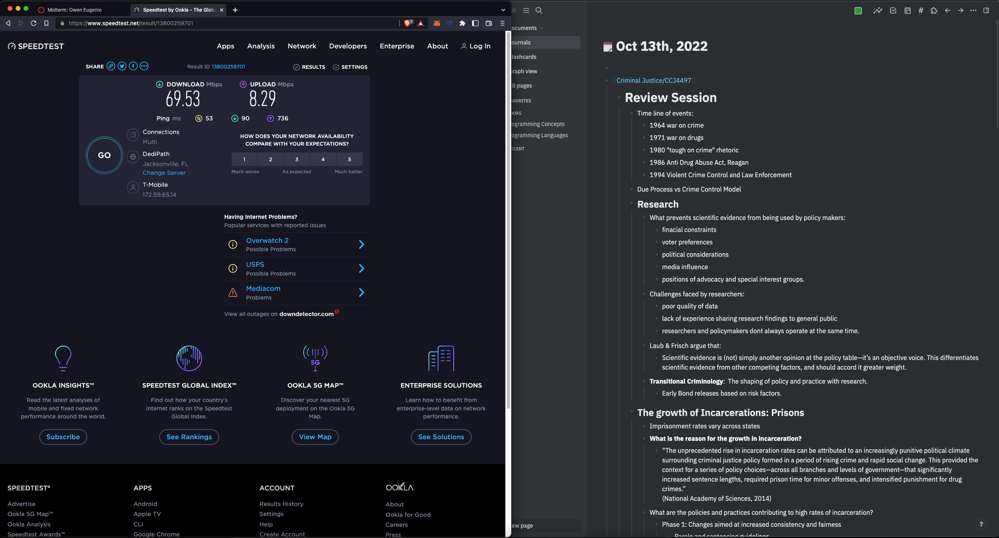

- {:height 77, :width 304}
-
- which substances is linked to the greatest amount of crime? Alchohol, crack, heroine, or meth, pick one.
	- drugs
	- marijuana, meth, and PCP are all substances which have been linked to high levels of crime.
-
- [[Archive/Criminal Justice/CCJ4497]]
	- # Review Session
	  heading:: 1
		- Time line of events:
			- 1964 war on crime
			- 1971 war on drugs
			- 1980 "tough on crime" rhetoric
			- 1986 Anti Drug Abuse Act, Reagan
			- 1994 Violent Crime Control and Law Enforcement
		- Due Process vs Crime Control Model
		- ## Research
		  heading:: 2
			- What prevents scientific evidence from being used by policy makers:
				- finacial constraints
				- voter preferences
				- political considerations
				- media influence
				- positions of advocacy and special interest groups.
			- Challenges faced by researchers:
				- poor quality of data
				- lack of experience sharing research findings to general public
				- researchers and policymakers dont always operate at the same time.
			- Laub & Frisch argue that:
				- Scientific evidence is (not) simply another opinion at the policy table—it’s an objective voice. This differentiates scientific evidence from other competing factors, and should accord it greater weight.
			- **Transitional Criminology**:  The shaping of policy and practice with research.
				- Early Bond releases based on risk factors.
		- ## The growth of Incarcerations: Prisons
		  heading:: 2
			- Imprisonment rates vary across states
			- **What is the reason for the growth in incarceration?**
				- “The unprecedented rise in incarceration rates can be attributed to an increasingly punitive political climate surrounding criminal justice policy formed in a period of rising crime and rapid social change. This provided the context for a series of policy choices—across all branches and levels of government—that significantly increased sentence lengths, required prison time for minor offenses, and intensified punishment for drug crimes.”
				  (National Academy of Sciences, 2014)
			- What are the policies and practices contributing to high rates of incarceration?
				- Phase 1: Changes aimed at increased consistency and fairness
					- Parole and sentencing guidelines
				- Phase 2: changes aimed at increased certainty and serverity
					- Truth-in-Sentencing laws
						- truth-in-sentencing laws require offenders to serve a substantial portion of their sentence and reduce the discrepancy between the sentence imposed and actual time served in prison.
			- What is the underlying cause of incarceration in terms of Crime, politics, and social change:
				- post-war era and the framing of crime and disorder
				- social and political turmoil of the '60s and '70s
				- Rising crime rates
				- Political and electoral realignment
			- 
				- A lot of crimes trending down, but homicide trending up.
			- ## New vs Old Penology
			  heading:: 2
				- Old Penology: Emphasized individual responsibility, diagnosis, and treatment
				- New Penology: concerned with the identification, classification, and management of dangerous groups.
					- The new penology was military like, stricter dispiline.
		- ## The Growth of Incarceration: Drug Policy and Challenges for moving past the war on drugs
		  heading:: 2
			- war on drugs happened in 1970
				- it's goal was to eradicate illicit drug use in the US
			- Over the last 4 decades, policymakers have enacted a number of drug polices that:
				- 1. included a heavy reliance on law enforcement and the criminal justice system.
				  2.  focus almost exclusively on zero-tolerance approaches to treatment and prevention