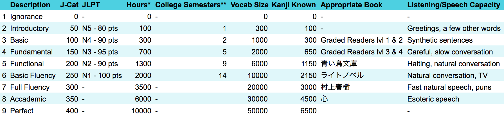

- Fluency Levels for learning japanese
	- 
- I have found by grouping katakana into similar groups based on character shape then flashcarding those groups, you become able to identify them easier. These are what will trick you up the most when practicing/learning.
-