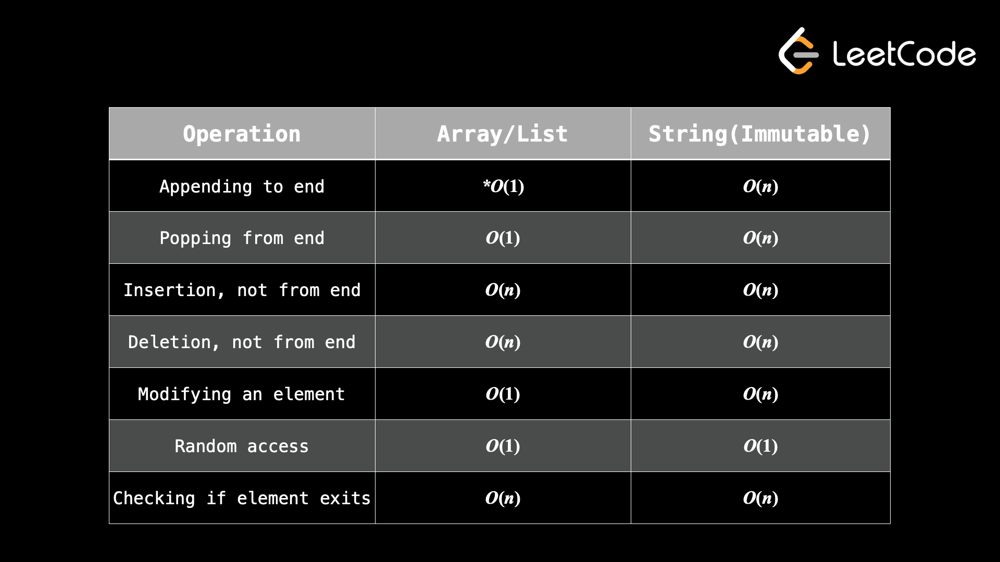

title:: Data Structures and Algorithms
tags:: [[Software Engineering]]

- {{query (page-property category [[Data Structures and Algorithms]])}}
  query-properties:: [:created-at :updated-at :page :category]
  collapsed:: true
- # Arrays and Strings
  heading:: 1
	- ## Sliding Window #[[Data Structures and Algorithms/Two Pointers]]
	  heading:: 2
		- Sliding window is actually implemented using two pointers.
		- Subarrays are just a section of an array.
			- **Left bound** the starting index
			- **Right bound** the ending index.
		- The idea behind the sliding window technique is to efficiently find the "best" window that fits some constraint.
		- The general algorithm behind sliding windows is:
			- 1. Define a pointer for the left and right bound that represents he current window, usually both of them start at 0.
			  2. iterate over the array with the round bound to "add" elements into the window.
			  3. Whenever the constraint is broken, then "remove" elements from the window by increasing the left bound until the condition is satisfied again.
		- The big idea behind sliding windows is to avoid doing duplicate instructions, for example by shifting the sliding window, we just have to modify the previous windows sum by removing the previous initial element, and then adding into the new ending element. https://youtu.be/GcW4mgmgSbw
		-
- # Arrays and strings:
  heading:: 1
	- {:height 515, :width 902}
	- ## Two Pointers
	  heading:: 2
		- Two-pointer pattern is an extremely common pattern used to solve array and string problems.
		- How to implement two pointer pattern:
			- 1. Start one pointer at the first index `0` and the other point at the last index `input.length -1`.
			  2. Use a while loop until the pointers are equal to each other.
			  3. At each iteration of the loop, move the pointers towards each other. This means either increment the pointer that started at the first index, decrement the pointer that started at the last index, or both. Deciding which pointer to move will depend on the problem we are trying to solve.
		- Example problems that two pointer show up on: 2sum, pascal's triangle 1, quicksort, selectsort, checkingForPalidrome
		- If you have a sorted array two pointer can also be useful (2sum but sorted)
		- ### Another Method for Two Pointers where you have two inputs:
		  heading:: 3
			- 1. Create two pointers, one for each iterable. Each pointer should start at the first index.
			  2. Use a while loop until one of the pointer reaches the end of it's iterable.
			  3. At each iteration of the loop, move the pointers forward. This means incrementing either one or both of the pointers. Deciding which pointer to move will depend on the problem we are trying to solve.
			  4. Because our while loop will stop when one of the pointers reaches the end, the other pointer will not be at the end when the loop finishes. Sometimes, we need to iterate through all the elements - if this is the case, you will need to write extra code here to make sure both iterables are exhausted.
		-
			-
- # Introduction to big O
  heading:: 1
	- Big O is a notation used to describe the computational complexity of an algorithm.
		- There are two ways to measure complexity: 1) time complexity, 2) space complexity.
			- The time complexity of an algorithm is the amount of time the algorithm needs to run relative to the input size.
			- The space complexity of an algorithm is the amount of memory allocated by the algorithm when run relative to the input size.
		- constants are always ignored when calculating complexity.
			- Therefore, O(999999n) = O(8n) = O(n) = O(n/500)
		- Addition/subtraction between terms of the **same** variable can also be ignored.
			- Therefore, O(2^n + n^2 - n)= O(2^n)
	- Complexity has three normal cases:
		- Best case scenario.
		- Average case.
		- Worst case scenario.
	- ## Analyzing time complexity
	  heading:: 2
		- Single For-loops, and  single loops = O(n)
			- When we have loops inside of loops we multiply N by the N inside, thefore for 2 loops, 1 inside of the other = O(n^2)
			- When loops are back to back (not inside of each other) then you just multiply by an integer coefficent
				- for 3 loops back to back: O(3n) = O(N) <- note constants are ignored so we can drop them.
			- When we have algorithms with 2 input arrays that differ, we take the O() of each array then add them together. eg: O(n+m)
	- ## Analyzing space complexity
	  heading:: 2
		- Typically we do not calculate the space used by the input, and we don't calculate the spaced used by the output (the answer) unless an interviewer asks us too.
			- Note: for space complexity we are only concerned about the types a variable is declared, not how often that variable is used.
			-