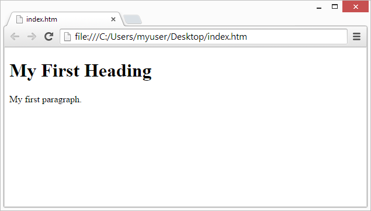

title:: HTML
category:: [[Front-End Development]]
tags:: [[web-development]], [[Front-End Development]], [[programming]]

- # Syntax
  heading:: 1
	- # Introduction
	  heading:: 1
	  id:: 634244aa-459b-4b3c-bc9f-0ce2469a82bc
		- ### [What is HTML?](https://www.w3schools.com/html/html_intro.asp)
		  heading:: 3
			- HTML stands for Hyper Text Markup Language
			- HTML is the standard markup language for creating Web pages.
			- HTML describes the structure of a Web page.
			- HTML consists of a series of elements.
			- HTML elements tell the browser how to display the content.
			- HTML elements label pieces of content such as "this is a heading", "this is a paragraph", "this is a link", etc.
		- #### A Simple HTML Document
		  heading:: 4
			- ```html
			  <!DOCTYPE html>
			  <html>
			  <head>
			  <title>Page Title</title>
			  </head>
			  <body>
			  
			  <h1>My First Heading</h1>
			  <p>My first paragraph.</p>
			  
			  </body>
			  </html>
			  ```
				- ### Explation of Example:
				  heading:: 3
					- The `<!DOCTYPE html>` declaration defines that this document is an HTML5 document.
					- The `<html>` element is the root element of an HTML page.
					- The `<head>` element contains meta information about the HTML page.
					- The `<title>` element specifies a title for the HTML page (which is shown in the browser's title bar or in the page's tab)
					- The `<body>` element defines the document's body, and is a container for all the visible contents, such as headings, paragraphs, images, hyperlinks, tables, lists, etc.
					- The `<h1>` element defines a large heading.
					- The `<p>` element defines a paragraph.
		- ### What is an HTML Element?
		  heading:: 3
			- An HTML element is defined by a start tag, some content, and an end tag:
				- ```html
				  <tagname> Content goes here... </tagname>
				  ```
			- The HTML **element** is everything from the start tag to the end tag:
				- ```html
				  <h1> My First Heading </h1>
				  
				  <p> My first paragraph. </p>
				  ```
		- ### Web Browsers
		  heading:: 3
			- The purpose of a web browser (Chrome, Edge, Firefox, Safari) is to read HTML documents and display them correctly.
			- A browser does not display the HTML tags, but uses them to determine how to display the document:
				- 
	- # Basics
	  heading:: 1
		- ### HTML Doccument
		  heading:: 3
			- All HTML documents must start with a doccument type declaration:
				- ```html
				  <!DOCTYPE html>
				  ```
			- The HTML doccument itself begins with the `<html>` tag and ends with the `</html>` tag.
			- The visible part of the HTML document is between `<body>` and `</body>`
			- Example:
				- ```html
				  <!DOCTYPE html>
				  <html>
				  <body>
				  
				  <h1>My First Heading</h1>
				  <p>My first paragraph.</p>
				  
				  </body>
				  </html>
				  ```
		- ### The `<!DOCTYPE> Declaration>`
		  heading:: 3
			- The `<!DOCTYPE>` declaration represents the document type, and helps browsers to display web pages correctly.
			- It must only appear once, at the top of the page (before any HTML tags).
			- The `<!DOCTYPE>` declaration is not case sensitive.
			- The `<!DOCTYPE>` declaration for HTML5 is:
				- ```html
				  <!DOCTYPE html>
				  ```
		- ### HTML Headings
		  heading:: 3
			- HTML headings are defined with the `<h1>` to `<h6>` tags.
			- `<h1>` defines the most important heading. `<h6>` defines the least important heading:
			- Example:
				- ```html
				  <h1>This is heading 1</h1>
				  <h2>This is heading 2</h2>
				  <h3>This is heading 3</h3>
				  ```
		- ### HTML Paragraphs
		  heading:: 3
			- HTML paragraphs are defined with the `<p>` tag:
				- ```html
				  <p>This is a paragraph.</p>
				  <p>This is another paragraph.</p>
				  ```
		- ### HTML Links
		  heading:: 3
			- HTML links are defined with the  `<a>`  tag:
				- ```html
				  <a href="https://www.w3schools.com">This is a link</a>
				  ```
			- The link's destination is specified in the `href` attribute.
			- Attributes are used to provide additional information about HTML elements.
		- ### HTML Images
		  heading:: 3
			- HTML images are defined with the `` tag.
			- The source file (`src`), alternative text(`alt`), `width`, and `height` are provided as attributes:
				- ```html
				  
				  ```
	- # Elements
	  heading:: 1
		- The HTML **element** is everything from teh start to the end tag:
			- ```html
			  <tagname>Content goes here...</tagname>
			  ```
		- ### Nested HTML elements
		  heading:: 3
			- HTML elements can be nested (this means that elements can contain other elements).
			- All HTML documents consist of neted HTML elements.
			- The following example contains four HTML elements (`<html>`, `<body>`, `<h1>`, `<p>`)
			- Example:
				- ```html
				  <!DOCTYPE html>
				  <html>
				  <body>
				  
				  <h1>My First Heading</h1>
				  <p>My first paragraph.</p>
				  
				  </body>
				  </html>
				  ```
				- Some HTML elements will display correctly, even if you forget the end tag. Make sure to never skip it.
		- ### Empty HTML Elements:
		  heading:: 3
			- HTML elements with no content are called empty elements.
			- The `<br>` tag defines a line break, and is an empty element without a closing tag
				- ```html
				  <p>This is a <br> paragraph with a line break.</p>
				  ```
				-
	- # Attributes
	  heading:: 1
		- reference:: https://www.w3schools.com/html/html_attributes.asp
		- All HTML elements can have **attributes**.
		- Attributes provide **additional information** about elements.
		- Attributes are always specified in **the start tag**.
		- Attributes usually come in name/value pairs like: **name="value"**
		- ### The href Attribute
		  heading:: 3
			- The `<a>` tag defines a hyperlink. The `href` attribute specifies the URL of the page the link goes to:
				- ```html
				  <a href="https://www.w3schools.com">Visit W3Schools</a>
				  ```
		- ### The src Attribute
		  heading:: 3
			- The `` tag is used to embed an image in an HTML in an HTML page. the `src` attribute specifies the path to the image to be displayed.
			- ```html
			  
			  ```
			- There are two ways to specify the URL in the `src` attribute
				- 1. **Absolute URL** - links to an external image that is hosted on another website. Example: 
				  ```html
				  src="https://www.w3schools.com/images/img_girl.jpg"
				  ```
				  2.**Relative URL** - Links to an image that is hosted within the website. Here, the URL does not include the domain name. If the URL begins without a slash, it will be relative to the current page. Example: 
				  
				  ```html
				  src="img_girl.jpg"
				  ```
				- **Tip:** It is almost always best to use relative URLs. They will not break if you change domain.
		- ### The width and height Attributes:
		  heading:: 3
			- The `` tag should also contain the `width` and the `height` attributes, which specify the width and height of the image (in pixels):
				- ```html
				  
				  ```
		- ### The alt Attribute
		  heading:: 3
			- The required `alt` attribute for the `` tag specifies an alternate text for an image, if the image for some reason cannot be displayed. This can be due to a slow connection, or an error in the `src` attribute, or if the user uses a screen reader.
				- ```html
				  
				  ```
		- The style Attribute
			- the `style` attribute is used to add styles to an element, such as color, font, size, and more.
				- ```html
				  <p style="color:red;">This is a red paragraph.</p>
				  ```
				- More information on styles can be found in the chapter titled ((63463d56-d123-4b9c-88f7-43798b840806))
		- ## the lang Attribute
		  heading:: 2
			- You should always include the `lang` attribute inside the `<html>` tag, to declare the language of the Web page. This is meant to assist search engines and browsers.
			- The following example specifies English as the language:
				- ```html
				  <!DOCTYPE html>
				  <html lang="en">
				  <body>
				  ...
				  </body>
				  </html>
				  ```
			- Country codes can also be added to the language code in the `lang` attribute. So the first two characters define the language of the HTML page, and the last two characters define the country.
			- The following example specifies English as the language and United States at the country:
				- ```html
				  <!DOCTYPE html>
				  <html lang="en-US">
				  <body>
				  ...
				  </body>
				  </html>
				  ```
		- ### the title Attribute
		  heading:: 3
			- The `title` attribute defines some extra information about an element.
			- The value of the title attribute will be displayed as a tooltip when you mouse over the element:
				- ```html
				  <p title="I'm a tooltip">This is a paragraph.</p>
				  ```
				- Suggestion: all use lowercase attributes.
					- This helps with stricter doccument types, such as XHTML.
				- Suggestion: always quote attribute values.
					- The HTML standard does not require quote around attributes, however, XHTML and other stricture formats do.
		- ### Single or double quotes?
		  heading:: 3
			- Either work, but sometimes it's useful to use single. For example, when they text you want has double quotes inside fo it. And vice versa
				- ```html
				  <p title='John "ShotGun" Nelson'>
				  ```
		-
	- # Paragraphs
	  heading:: 1
		- A paragraph always starts on a new line, and is usually a block of text.
		- The HTML `<p>` element defines a paragraph
		- A paragraph always start on a new line, and browsers automatically add some white space (a margin) before and after a paragraph.
		- ```html
		  <p>This is a paragraph.</p>
		  <p>This is another paragraph.</p>
		  ```
		- ### HTML Display
		  heading:: 3
			- You cannot be sure how HTML will be displayed. Large or small screen, and resized windows will create different results.
			- With your HTML, you cannot change the display by adding extra spaces or extra lines in your HTML code.
			- The browser will automatically remove any extra spaces and lines when the page is displayed:
				- ```html
				  <p>
				  This paragraph
				  contains a lot of lines
				  in the source code,
				  but the browser
				  ignores it.
				  </p>
				  
				  <p>
				  This paragraph
				  contains         a lot of spaces
				  in the source         code,
				  but the        browser
				  ignores it.
				  </p>
				  ```
				- One way you can have extra spaces and lines is with the `<pre>`
					- ```html
					  <pre>
					  My Bonnie lies over the ocean.
					  
					  My Bonnie lies over the sea.
					  
					  My Bonnie lies over the ocean.
					  
					  Oh, bring back my Bonnie to me.
					  </pre>
					  ```
		- ### HTML Horizontal Rules
		  heading:: 3
			- The `<hr>` tag defines a thematic break in an HTML Page, and is most often displayed as a horizontal rule.
			- The `<hr>` element is used to seperate content (or define a change) in an HTML page:
				- ```html
				  <h1>This is heading 1</h1>
				  <p>This is some text.</p>
				  <hr>
				  <h2>This is heading 2</h2>
				  <p>This is some other text.</p>
				  <hr>
				  ```
		- ### HML Line Breaks:
		  heading:: 3
			- The HTML `<br>` element defiens a line break.
			- Use `<br>` if you want a line break (a new line) without starting a new paragraph.
	- # Styles
	  heading:: 1
	  id:: 63463d56-d123-4b9c-88f7-43798b840806
		- The HTL `style` attribute is used to add styles to an element, such as color, font, size, and more.
		- The HTML `style` attribute has the following syntax:
			- ```html
			  <tagname style="property:value;">
			  ```
				- The **property** is a [CSS]([[CSS]]) property. The **value** is a [CSS]([[CSS]]) value.
		- ### Background Color
		  heading:: 3
			- The CSS `background-color` property defines the background color for an HTML element.
				-
					- Set the background colorr for a page to powderblue: 
					  
					  ```html
					  <body style="background-color:powderblue;">
					  
					  <h1>This is a heading</h1>
					  <p>This is a paragraph.</p>
					  
					  </body>
					  ```
		- ### Text Color
		  heading:: 3
			- The [CSS]([[CSS]])  `color` property defines the text color for an HTML element:
				- ```html
				  <h1 style="color:blue;">This is a heading</h1>
				  <p style="color:red;">This is a paragraph.</p>
				  ```
		- ### Fonts
		  heading:: 3
			- The [CSS]([[CSS]]) `font-family` property defines the font to be used for an HTML element:
				-
					- ```html
					  <h1 style="font-family:verdana;">This is a heading</h1>
					  <p style="font-family:courier;">This is a paragraph.</p>
					  ```
		- ### Text Size
		  heading:: 3
			- The [CSS]([[CSS]]) `font-size` property defines the text size for an HTML element:
				-
					- ```html
					  <h1 style="font-size:300%;">This is a heading</h1>
					  <p style="font-size:160%;">This is a paragraph.</p>
					  ```
		- ### Text Alignment
		  heading:: 3
			- The [CSS]([[CSS]]) `text-align` property defines the horizontal text alignment for an HTML element:
				-
					- ```html
					  <h1 style="text-align:center;">Centered Heading</h1>
					  <p style="text-align:center;">Centered paragraph.</p>
					  ```
	- ## Text Formatting
	  heading:: 2
		- HTML contains several elements for defining text with a special message.
		- ### HTML Formatting Elements
		  heading:: 3
			- `<b>`  - Bold text
			- `<strong>`  - Important text
			- `<i>`  - Italic text
			- `<em>`  - Emphasized text
			- `<mark>`  - Marked text / highlighted text
			- `<small>`  - Smaller text
			- `<del>`  - Deleted text / strike through
			- `<ins>`  - Inserted text
			- `<sub>`  - Subscript text
			- `<sup>`  - Superscript text
	- ## Quotation and Citation Elements
	  heading:: 2
		- ### Block quotes:
		  heading:: 3
			- The `<blockquote>` element defines a section that is quoted from another source.
			- Browsers usually indent `<blockquote>` elements.
		- ### Short Quotations
		  heading:: 3
			- The HTML `<q>` tag defines a short quotation.
			- Browsers normally insert quotation marks around the quotation.
		- ### HTML <abbr> for Abbreviations
		  heading:: 3
			- The HTML `<abbr>` tag defines an abbreviation or an acronym, like "HTML", "CSS", "Dr.", "ASAP". "ATM".
			- Marking abbreviation can give useful information to browsers, translation systems and search-engines.
		- ### HTML <address> for Contact Information
		  heading:: 3
			- The HTML `<address>` tag defines the contact information for the author/owner of a document or an article.
			- The contact information can be an email address, URL, physical address, phone number, social media handle, etc.
			- The text in the `<address>` element usually renders in *italic*, and browsers will always add a line break before and after the `<address>` element.
		- ### HTML <cite> for a Work's Title
		  heading:: 3
			- The HTML `<cite>` tag defines the title of a creative work (eg. a book, poem, song, etc.)
				- **NOTE:** a person's name is not the title of a work.
			- The text in the `<cite>` element usually renders in *italics*.
		- ### HTML <bdo> for Bi-Directional Override (aka displaying text right to left)
		  heading:: 3
			- The HTML `<bdo>` tag is used to override the current text direction:
				- Example:
				  ```html
				  <bdo dir="rtl">This text will be written from right to left</bdo>
				  ```
			-
	- ## Comments
	  heading:: 2
		- Two write comments in HTML, you do the following:
		  ```html
		  <!-- Write your comments here -->
		  ```
		-
	- ## Colors
	  heading:: 2
		- Colors are specified with predefined color names, or with RGB, HEX, HSL, RGBA, or HSLA values.
		- ### Background Color
		  heading:: 3
			- You can use the style attribute to set a background color:
				- ```html
				  <h1 style="background-color:DodgerBlue;">Hello World</h1>
				  <p style="background-color:Tomato;">Lorem ipsum...</p>
				  ```
		- ### Text Color
		  heading:: 3
			- You can also set the text color by using the style attribute
				- ```html
				  <h1 style="color:Tomato;">Hello World</h1>
				  <p style="color:DodgerBlue;">Lorem ipsum...</p>
				  <p style="color:MediumSeaGreen;">Ut wisi enim...</p>
				  ```
		- ### Border Color
		  heading:: 3
			- You can also set border colors the same way:
				- ```html
				  <h1 style="border:2px solid Tomato;">Hello World</h1>
				  <h1 style="border:2px solid DodgerBlue;">Hello World</h1>
				  <h1 style="border:2px solid Violet;">Hello World</h1>
				  ```
		- ### Color Values
		  heading:: 3
			- Colors can also be assigned via rba, hex, and hsl
				- ```html
				  <h1 style="background-color:rgb(255, 99, 71);">...</h1>
				  <h1 style="background-color:#ff6347;">...</h1>
				  <h1 style="background-color:hsl(9, 100%, 64%);">...</h1>
				  
				  <h1 style="background-color:rgba(255, 99, 71, 0.5);">...</h1>
				  <h1 style="background-color:hsla(9, 100%, 64%, 0.5);">...</h1>
				  ```
			-
	- ## CSS
	  heading:: 2
		- [[CSS]] stands for Cascading Style Sheets.
		- [[CSS]] saves a lot of work. It can control the layout of multiple web page at once.
		- ### What is CSS?
		  heading:: 3
			- Cascading Style sheets ([[CSS]]) is used to format the layout of webpage.
			- With [[CSS]], you can control the color, font, the size of text, the spacing between elements, how elements are positioned and laid out, what background images or background colors are to be used, different displays for different devices and screen sizes, and much more!
		- ### Using CSS
		  heading:: 3
			- [[CSS]] can be added to HTML documents in 3 ways
				- 1. **Inline** - by using the `style` attribute inside HTML elements.
				  2. **Internal** - by using a `<style>` element in the `<head>` section.
				  3. **External** - by using a `<link>` element to link to an external css file.
			- ### Inline CSS
			  heading:: 3
				- An inline CSS is used to apply a unique style to a single HTML element.
				- An inline CSS uses the `style` attribute of an HTML element.
				- The following example sets the text color of the `<h1>` element to blue, and the text color of the `<p>` element to red:
					- ```html
					  <h1 style="color:blue;">A Blue Heading</h1>
					  
					  <p style="color:red;">A red paragraph.</p>
					  ```
			- ### Internal CSS
			  heading:: 3
				- An internal CSS is used to define a style for a single HTML page.
				- An internal CSS is defined in the `<head>` section of an HTML page, with a `<style>` element.
				- Example:
					- ```html
					  <!DOCTYPE html>
					  <html>
					  <head>
					  <style>
					  body {background-color: powderblue;}
					  h1   {color: blue;}
					  p    {color: red;}
					  </style>
					  </head>
					  <body>
					  
					  <h1>This is a heading</h1>
					  <p>This is a paragraph.</p>
					  
					  </body>
					  </html>
					  ```
			- ### External CSS
			  heading:: 3
				- An external style sheet is used to define the style of many HTML pages.
				- To use an external style sheet, add a link to it in the `<head>` section of each HTML page:
					- Example:
						- HTML:
							- ```html
							  <!DOCTYPE html>
							  <html>
							  <head>
							  <link rel="stylesheet" href="styles.css">
							  </head>
							  <body>
							  
							  <h1>This is a heading</h1>
							  <p>This is a paragraph.</p>
							  
							  </body>
							  </html>
							  ```
						- CSS: "styles.css"
							- ```
							  body {
							  background-color: powderblue;
							  }
							  h1 {
							  color: blue;
							  }
							  p {
							  color: red;
							  }
							  ```
				- ### CSS Colors, Fonts, and Sizes
				  heading:: 3
					- The [[CSS]] `color` property defines the text color to be used
					- The [[CSS]] `font-family` property defines the font to be used.
					- The [[CSS]] `font-size` property defines the text size to be used.
					- Examples:
					  ```html
					  <!DOCTYPE html>
					  <html>
					  <head>
					  <style>
					  h1 {
					  color: blue;
					  font-family: verdana;
					  font-size: 300%;
					  }
					  p {
					  color: red;
					  font-family: courier;
					  font-size: 160%;
					  }
					  </style>
					  </head>
					  <body>
					  
					  <h1>This is a heading</h1>
					  <p>This is a paragraph.</p>
					  
					  </body>
					  </html>
					  ```
				- ### CSS Border
				  heading:: 3
					- The [[CSS]] `border` property defines a border around an HTML element.
						- ```html
						  p {
						  border: 2px solid powderblue;
						  }
						  ```
				- ## CSS Padding
				  heading:: 2
					- The [[CSS]] `padding` property defines a padding (space) between the text and the border.
						- Example:
						  ```html
						  p {
						  border: 2px solid powderblue;
						  padding: 30px;
						  }
						  ```
				- ## CSS Margin
				  heading:: 2
					- The [[CSS]] Margin property defines a margin (space) outside the border
						- ```html
						  p {
						  border: 2px solid powderblue;
						  margin: 50px;
						  }
						  ```
				- ### Link to External CSS
				  heading:: 3
					- External style sheets can be references with a full URL or with a path relative to the current web page.
						- ```html
						  <link rel="stylesheet" href="https://www.w3schools.com/html/styles.css">
						  ```
					-
	- ## Hyperlinks
	  heading:: 2
		- The HTML `<a>` tag defines a hyperlink
			- ```html
			  <a href="url">link text</a>
			  ```
		- The important thing to remember about the `<a>` element is that `href` attribute, indicated the links destination.
			- ```html
			  <a href="https://www.w3schools.com/">Visit W3Schools.com!</a>
			  ```
		- ### The `target` Attribute
		  heading:: 3
			- By default, the linked page will be displayed in the current browser window. To change this, you must specify another target for the link.
			- The `target` attribute specifies where to open the linked document.
			- The `target` attribute can have one of the following values:
				- `_self` - default. Opens the document in the same window/tab as it was clicked.
				- `_blank` - opens the document in a new window or tab.
				- `_top` - Opens the document in the full body of the window.
		- ### Using an Image as a link
		  heading:: 3
			- To use an image as a link, just put the `` tag inside the `<a>` tag:
				- ```html
				  <a href="default.asp">
				  
				  </a>
				  ```
		- ### Link to an Email Address
		  heading:: 3
			- Use the `mailto:` inside the `href` attribute to create a link that opens the user's email program (to let them send a new email):
				- ```html
				  <a href="mailto:someone@example.com">Send email</a>
				  ```
		- ### Button as a Link
		  heading:: 3
			- To use an HTML button as a link, you have to add some [[JavaScript]] code.
			- [[JavaScript]] allows you to specify what happens at certain events, such as a click of a button:
				- ```html
				  <button onclick="document.location='default.asp'">HTML Tutorial</button>
				  ```
		- ## Link Titles
		  heading:: 2
			- The `title` attribute specifies extra information about an element. The information is most often shown as a tooltip text when the mouse moves over the element.
				- ```html
				  <a href="https://www.w3schools.com/html/" title="Go to W3Schools HTML section">Visit our HTML Tutorial</a>
				  ```
		- ### Different Colors for links
		  heading:: 3
			- By default, link colors will appear as the following:
				- An unlisted link  is underlined and blue
				- A visited link is underlined and purple
				- An active link is underlined and red.
			- You can change link state colors by using [[CSS]]
				- ```html
				  <style>
				  a:link {
				  color: green;
				  background-color: transparent;
				  text-decoration: none;
				  }
				  
				  a:visited {
				  color: pink;
				  background-color: transparent;
				  text-decoration: none;
				  }
				  
				  a:hover {
				  color: red;
				  background-color: transparent;
				  text-decoration: underline;
				  }
				  
				  a:active {
				  color: yellow;
				  background-color: transparent;
				  text-decoration: underline;
				  }
				  </style>
				  ```
		- ### Link Buttons
		  heading:: 3
			- A link can also be styled as a button, by using [[CSS]]
				- ```html
				  <style>
				  a:link, a:visited {
				  background-color: #f44336;
				  color: white;
				  padding: 15px 25px;
				  text-align: center;
				  text-decoration: none;
				  display: inline-block;
				  }
				  
				  a:hover, a:active {
				  background-color: red;
				  }
				  </style>
				  ```
		- ### Create Bookmarks
		  heading:: 3
			- HTML links can be used to create bookmarks, so that readers can jump to specific parts of a web page.
				- ### Example
				  heading:: 3
					- First, use the `id` attribute to create a bookmark:
						- ```html
						  <h2 id="C4">Chapter 4</h2>
						  ```
					- Then add a link to the bookmark ("Jump to Chapter 4"), from within the same page:
						- ```html
						  <a href="#C4">Jump to Chapter 4</a>
						  ```
					- You can also add a link to a bookmark on another page:
						- ```html
						  <a href="html_demo.html#C4">Jump to Chapter 4</a>
						  ```
	- ## Images
	  heading:: 2
		- Images can improve the design and appearance of a web page
		- Example:
			- ```html
			  
			  ```
		- ### Image Syntax
		  heading:: 3
			- The HTML `` tag is used to embed an image into a web page.
			- Images are not technically inserted into a web page; images are linked to web pages.
			- The `` tag creates a holding space for the referenced image.
			- The `` tag is empty, it contains attributes only, and does not have a closing tag.
			- The `` tag has two required attributes:
			- `src` - specifies the path to the image
			- `alt` - specifies an alternate text for the image
		- ### The `src` Attribute
		  heading:: 3
			- The required `src` attribute specifies the path (URL) to the image.
			- ```html
			  
			  ```
		- ### The `alt` Attribute
		  heading:: 3
			- The required alt attribute provides an alternate text for an image, if the user for some reason cannot view it
				- reasons a user may not be able to view it:
					- slow connection
					- error at the src attribute
					- or if the user uses a screen reader
			- The value of the `alt` attribute should describe the image:
		- ### Image Size - Width and Height
		  heading:: 3
			- You can use the `style` attribute to specify the width and height of an image.
				- ```html
				  
				  ```
			- Alternatively, you can use the width and height attributes:
				- ```html
				  
				  ```
			- It is best practice to just use the `style` attribute however.
		- ### Image as a Link
		  heading:: 3
			- To use an image as a link, put the `` tag inside the `<a>` tag:
				- ```html
				  <a href="default.asp">
				  
				  </a>
				  ```
		- ### Image Floating
		  heading:: 3
			- Use the CSS `float` property to let the image float to the right or to the left of a text:
				- ```html
				  <p>
				  The image will float to the right of the text.</p>
				  
				  <p>
				  The image will float to the left of the text.</p>
				  ```
		- ### Image Maps
		  heading:: 3
			- The HTML `<map>` tag defines an image map. An image map is an image with clickable areas. The areas that are defined with one or more `<area>`
			- ### How does it work?
			  heading:: 3
				- The idea behind an image map is that you should be able to preform different actions depending on where in the image you click.
				- To create an image map, you need an image, and some HTML code that describes clickable areas.
					- ```html
					  
					  
					  <map name="workmap">
					  <area shape="rect" coords="34,44,270,350" alt="Computer" href="computer.htm">
					  <area shape="rect" coords="290,172,333,250" alt="Phone" href="phone.htm">
					  <area shape="circle" coords="337,300,44" alt="Coffee" href="coffee.htm">
					  </map>
					  ```
				- The image is inserted using the `` tag. The only difference from other images is that you must add a `usemap` attribute:
					- ```html
					  
					  ```
				- After this, you have to create a map with the `<map>` element:
					- ```html
					  <map name="workmap">
					  ```
				- The clickable areas are defined by using the `<area>` element. You must define the shape of the clickable area via the `shape` for the `<map>` tag.
					- You can choose one of these values for `shape`:
						- `rect` - defines a rectangular region
						- `circle` - defines a circular region
						- `poly` - defines a polygonal region
						- `default` - defines the entire region.
					- Example:
						- ```html
						  <area shape="rect" coords="34, 44, 270, 350" href="computer.htm">
						  ```
				- If you are using the `poly` attribute, you must provide a set of coords
					- 
					- ```html
					  <area shape="poly" coords="140,121,181,116,204,160,204,222,191,270,140,329,85,355,58,352,37,322,40,259,103,161,128,147" href="croissant.htm">
					  ```
			- ### Image Map and [[JavaScript]]
			  heading:: 3
				- A clickable area can also trigger a [[JavaScript]] function.
				- Add a `click` event to the `<area>` element to execute a [[JavaScript]] function when the area is clicked:
					- ```html
					  <map name="workmap">
					  <area shape="circle" coords="337,300,44" href="coffee.htm" onclick="myFunction()">
					  </map>
					  
					  <script>
					  function myFunction() {
					  alert("You clicked the coffee cup!");
					  }
					  </script>
					  ```
			- ### Background Images
			  heading:: 3
				- To add a background image on an HTML element, use the HTML `style` attribute and the [[CSS]] `background-image` property:
					- ```html
					  <p style="background-image: url('img_girl.jpg');">
					  ```
				- You can also specify the background image in the `<style>` element:
					- ```html
					  <style>
					  p {
					  background-image: url('img_girl.jpg');
					  }
					  </style>
					  ```
			- ### Background Image on a Page:
			  heading:: 3
				- If you want the entire page to have a background image, you must specify the background image on the `<body>` element:
					- ```html
					  <style>
					  body {
					  background-image: url('img_girl.jpg');
					  }
					  </style>
					  ```
				- ### Background repeat:
				  heading:: 3
					- If the background image is smaller than the element, the image will repeat itself, horizontally and vertically, until it reaches the end of the element.
					- To avoid the background image from repeating itself, set the the `background-repeat` property to `no-repeat`
						- ```html
						  <style>
						  body {
						  background-image: url('example_img_girl.jpg');
						  background-repeat: no-repeat;
						  }
						  </style>
						  ```
					- If you want the background image to cover the entire element, you can set the `background-size` property to `cover`
					- To make sure the entire element is always covered,  set the `background-attachment` property to `fixed`
					- If you want the background image to stretch to fit the entire element, you can set the `background-size` property to `100% 100%`
					-
- # Semantic HTML
  heading:: 1
	- ## What are Semantic Elements?
	  heading:: 2
		- A semantic element clearly describes its meaning to both the browser and the developer.
		- Examples of **non-semantic** elements: `<div>` and `<span>` -- tells nothing about its content.
		- Examples of **semantic** elements: `<form>`, `<table>`, and `<article>` - Clearly defines its content
	- ## Semantic Elements in HTML
	  heading:: 2
		- Many web sites contain HTML code like: `<div id="nav"> <div class="header"> <div id="footer">` to indicate navifation, header, and footer.
		- In HHTML there are some semantic elements that can be used to describe different parts of a web page:
			- 
			- `<article>`
			- `<aside>`
			- `<details>`
			- `<figcaption>`
			- `<figure>`
			- `<footer>`
			- `<header>`
			- `<main>`
			- `<mark>`
			- `<nav>`
			- `<section>`
			- `<summary>`
			- `<time>`
		- ## HTML `<section> Element`
		  heading:: 2
			- The `<section>` element defines a section in a doccument.
			- A section is a: "thematic grouping of content, typically with a heading".
			- Examples of where a `<section>` element can be used:
				- Chapters
				- Introduction
				- News Items
				- Contact information
			- A web page could normally be split into sections for introduction, content, and contact information.
			- Example, two sections are in this doccument:
				- ```html
				  <section>
				  <h1>WWF</h1>
				  <p>The World Wide Fund for Nature (WWF) is an international organization working on issues regarding the conservation, research and restoration of the environment, formerly named the World Wildlife Fund. WWF was founded in 1961.</p>
				  </section>
				  
				  <section>
				  <h1>WWF's Panda symbol</h1>
				  <p>The Panda has become the symbol of WWF. The well-known panda logo of WWF originated from a panda named Chi Chi that was transferred from the Beijing Zoo to the London Zoo in the same year of the establishment of WWF.</p>
				  </section>
				  ```
		- ## HTML `<article>` Element
		  heading:: 2
			- The `<article>` element specifies independent, self-contained content.
			- An article should make sense on its own, and it should be possible to distribute it independently from the rest of the web site.
			- Examples of where the `<article>` element can be used:
				- forum posts
				- blog posts
				- User comments
				- Product cards
				- Newspaper articles
			- Example:
				- ```html
				  <article>
				  <h2>Google Chrome</h2>
				  <p>Google Chrome is a web browser developed by Google, released in 2008. Chrome is the world's most popular web browser today!</p>
				  </article>
				  
				  <article>
				  <h2>Mozilla Firefox</h2>
				  <p>Mozilla Firefox is an open-source web browser developed by Mozilla. Firefox has been the second most popular web browser since January, 2018.</p>
				  </article>
				  
				  <article>
				  <h2>Microsoft Edge</h2>
				  <p>Microsoft Edge is a web browser developed by Microsoft, released in 2015. Microsoft Edge replaced Internet Explorer.</p>
				  </article>
				  ```
		- ### Nesting `<article>` in `<section>` or Vice Versa?
		  heading:: 3
			- The `<article>` element specifies independent, self contained content.
			- The `<section>` element defines a section in a doccument.
			- You can nest vice versa.
	- ## HTML `<header>` Element
	  heading:: 2
		- The `<header>` element represents a container for introductory content or a set of navigational links.
		- A `<header>` element typically contains:
			- One or more heading elements (`<h1) to <h6>`)
			- Logo or icon
			- authorship information
		- **Note:** You can have several `<header>` elements in one HTML document. However, `<header>` cannot be placed within a `<footer>`, `<address>` or another `<header>`
	- ## HTML `<footer>` Element
	  heading:: 2
		- The `<footer>` element works very similarly to the `<header>` except it for making a footer.
		- Common usages are for:
			- authorship information
			- copyright information
			- contact information
			- sitemap
			- back to top links
			- related documents
		- You can have several `<footer>` elements in one document.
	- ## HTML `<nav>` Element
	  heading:: 2
		- The `<nav>` Element defines a set of navifation links.
		- The nav element is meant for only the major blocks of navigation links.
			- Example:
			  ```html
			  <nav>
			  <a href="/html/">HTML</a> |
			  <a href="/css/">CSS</a> |
			  <a href="/js/">JavaScript</a> |
			  <a href="/jquery/">jQuery</a>
			  </nav>
			  ```
	- ## HTML `<aside>` Element
	  heading:: 2
		- The `<aside>` element defines some content aside from the content it is placed in (like a sidebar).
		- The `<aside>` content should be indirectly related to the surrounding content.
		- ```html
		  <p>My family and I visited The Epcot center this summer. The weather was nice, and Epcot was amazing! I had a great summer together with my family!</p>
		  
		  <aside>
		  <h4>Epcot Center</h4>
		  <p>Epcot is a theme park at Walt Disney World Resort featuring exciting attractions, international pavilions, award-winning fireworks and seasonal special events.</p>
		  </aside>
		  ```
	- ### HTML <figure> and <figcaption> Elements
	  heading:: 3
		- The `<figures>` tag specifies self-contained content, like illustrations, diagrams, photos, code listings, etc.
		- The `<figcaption>` tag defines a caption for a `<figure>` element. The `<figcaption>` element can be placed as the first or as the last child of a `<figure>`
		- The `` element defines the actual image/illustration
		- Example
		  ```html
		  <figure>
		  
		  <figcaption>Fig1. - Trulli, Puglia, Italy.</figcaption>
		  </figure>
		  ```
	- ## Why Semantic Elements?
	  heading:: 2
		- "A semantic web allows data to be shared and reused across applications, enterprises, and communities."
		-
- # Client-Side Form Validaiton
  heading:: 1
	- ## Introduction
	  heading:: 2
		- Notes taken from: [Mozilla web docs](https://developer.mozilla.org/en-US/docs/Learn/Forms/Form_validation#what_is_form_validation)
		- **Client-side form validation:** ensuring all required form controls are filled out, in the correct format, before submitting data to the server.
		- Client-side validation is an initial check and an important feature of good user experience; by catching invalid data on the client-side, the user can fix it straight away.
			- However, client-side validation *should not be considered* an exhaustive security measure!
			- This is because client side validation is easy to bypass, i.e. tampering the post requests.
	- ## What is Form validation?
	  heading:: 2
		- **Form Validation** is when "you enter data, the browser and/or the web server will check to see that the data is in the correct format and within the constraints set by the application"
	- ## What are the different types of form validaitons?
	  heading:: 2
		- **Built-in form validation** uses HTML form validation features.
		- **[[JavaScript]] Form Validation** is completely customizable, but you need to create it all (or use a library).
	- ## Using Built-in form validation
	  heading:: 2
		- We can check if a form is valid by using the validation attributes on form elements.
			- `required` - specifies whether a form field needs to be filled in before the form can be submitted.
			- `minlength`and `maxlength` - specifies the minimum and maximum length of textual data (strings).
			- `min` and `max` - specifies the minimum and maximum values of numerical input types.
			- `type` - specifies whether the data needs to be a number, an email address, or some other specific preset type.
			- `pattern` - specifies a [[Regular Expression]] that defines a pattern the enter data needs to follow.
		- When an element is valid, the following are true:
			- The element matches the `:valid` [[CSS]] pseudo-class, which lets you apply a specific style to valid elements.
			- If the user tries to send the data, the browser will submit the form, provided there is nothing else stopping it from doing so (e.g. JavaScript)
		- When an element is invalid, the following are true:
			- The element matches the `:invalid` [[CSS]] pseudo-class, which lets you apply a specific style to valid elements.
			- If the user tries to send the data, the browser will block the form and display an error message.
		-
		- ### Validating against a regular expression
		  heading:: 3
			- Example:
				- ```html
				  <form>
				  <label for="choose">Would you prefer a banana or a cherry?</label>
				  <input id="choose" name="i-like" required pattern="[Bb]anana|[Cc]herry" />
				  <button>Submit</button>
				  </form>
				  ```
			-
	- ## Validating forms using [[JavaScript]]
	  heading:: 2
		- You must use [[JavaScript]] if you want to take control over the look and feel of native error messages. In this section, we will look at the different ways to do this.
		- ### The constraint Validation API
		  heading:: 3
			- Most browsers support the Constraint Validation API, which consists of a set of methods and properties available on the follow form element DOM interfaces:
			- TODO When I learn about [[JavaScript]] I need to come back and learn about this, as I do not know enough yet.
			-
- # Best Practices
  heading:: 1
	- ## Start with DOCTYPE
	  heading:: 2
		- Bad:
		- ```html
		  <html>
		  ...
		  </html>
		  ```
		- Good:
		  ```html
		  <!DOCTYPE html>
		  <html>
		  ...
		  </html>
		  ```
	- ## Escape `&`, `<`, `>`, `"`, `'`with named character references
	  heading:: 2
		- These character should escape always for a bug-free HTML document.
		- Bad:
		  ```html
		  <h1>The "&" character</h1>
		  ```
		- Good:
		  ```html
		  <h1>The &quot;&amp;&quot; character</h1>
		  ```
	- ## Use numeric character references for control or invisible characters
	  heading:: 2
		- These characters are easily mistaken for another character. Also spec does not guarantee to define a human readable name for these characters.
		- Bad:
		  ```html
		  <p>This book can read in 1 hour.</p>
		  ```
		- Good:
		  ```html
		  <p>This book can read in 1&#xA0;hour.</p>
		  ```
	- ## Put white spaces around comment contents
	  heading:: 2
		- Some Characters cannot be used immediately after comment open or before comment close.
		- Bad:
			- ```html
			  <!--This section is non-normative-->
			  ```
		- Good:
		  ```html
		  <!-- This section is non-normative -->
		  ```
	- ## Don't omit closing tag
	  heading:: 2
		- Bad:
		  ```html
		  <html>
		  <body>
		    ...
		  ```
		- Good:
		  ```html
		  <html>
		  <body>
		    ...
		  </body>
		  </html>
		  ```
	- ## Don't mix empty element format
	  heading:: 2
		- Consistency is a key for readability
		- Bad:
		  ```html
		  
		  <hr />
		  ```
		- Good:
		  ```html
		  
		  <hr>
		  ```
	- ## Don't put whitespace around tags and attribute values:
	  heading:: 2
		- Bad: 
		  ```html
		  <h1 class=" title " >HTML Best Practices</h1>
		  ```
		- Good:
		  ```html
		  <h1 class="title">HTML Best Practices</h1>
		  ```
	- ## Don't mix character cases
	  heading:: 2
		- Bad:
		  ```html
		  <a HREF="#general">General</A>
		  ```
		- Good:
		  ```html
		  <a href="#general">General</a>
		  ```
		- Also good:
		  ```html
		  <A HREF="#general">General</A>
		  ```
	- ## Don't mix quotation marks
	  heading:: 2
		- Bad:
		  ```html
		  
		  ```
		- Good:
		  ```html
		  
		  ```
	- ## Don't separate attributes with two or more white spaces
	  heading:: 2
		- Bad:
		  ```html
		  <input   name="q"  type="search">
		  ```
		- Good:
		  ```html
		  <input name="q" type="search">
		  ```
	- ## Omit boolean attribute value
	  heading:: 2
		- Bad:
		  ```html
		  <audio autoplay="autoplay" src="/audio/theme.mp3">
		  ```
		- Good:
		  ```html
		  <audio autoplay src="/audio/theme.mp3">
		  
		  ```
	- ## Omit Namespaces
	  heading:: 2
		- SVG and MathML can be used directly in an HTML doccument
		- Bad:
		  ```html
		  <svg xmlns="http://www.w3.org/2000/svg">
		  ...
		  </svg>
		  ```
		- Good:
		  ```html
		  <svg>
		  ...
		  </svg>
		  ```
	- ## Don't use XML attributes
	  heading:: 2
		- Bad:
		  ```html
		  <span lang="ja" xml:lang="ja">...</span>
		  ```
		- Good:
		  ```html
		  <span lang="ja">...</span>
		  ```
	- ## Root element
	  heading:: 2
		- ## add a `lang` attribute
		  heading:: 2
			- `lang` attribute will help translating an HTML doccument.
			- Bad:
			  ```html
			  <html>
			  ```
			- Good:
			  ```html
			  <html lang="en-US">
			  ```
		- ## Keep `lang` attribute values as short as possible
		  heading:: 2
			- Japanese is only used in Japan. So country code is not necessary
			- Bad:
			  ```html
			  <html lang="ja-JP">
			  ```
			- Good:
			  ```html
			  <html lang="ja">
			  ```
		- ## Add `title` element
		  heading:: 2
			- A value for the `title` element is used by various applications, not only a browser.
			- Bad:
			  ```html
			  <head>
			  <meta charset="UTF-8">
			  </head>
			  ```
			- Good:
			  ```html
			  <head>
			  <meta charset="UTF-8">
			  <title>HTML Best Practices</title>
			  </head>
			  ```
		- TODO read the rest of this: https://github.com/hail2u/html-best-practices