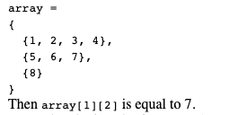

tags:: [[Programming Language]]

- {{embed ((633ee97b-7f1f-4188-87da-7abf3ec19818))}}
- # Dependency Injection in Java
  heading:: 1
	- Dependency injection is basically providing the objects that an object needs (its dependencies) instead of having it construct them itself. It's a very useful technique for testing, since it allows dependencies to be mocked or stubbed out. https://youtu.be/jLMX4Dfj2-8
- # Basic Elements
  heading:: 1
  id:: 633ee97b-7f1f-4188-87da-7abf3ec19818
	- A valid identifier is made up of characters, letters, underscores(_), dollar signs ($), or digits.
		- A valid identifier must * NOT * start with a digit.
		- A valid identifier also must * NOT * be a reserved word.
		- identifiers are case sensitive.
	- Java's built in types are:
		- boolean, char, byte, short, int, long, float, double ** Go back and define all of these **
	- The arthermetic operators in java are:
		- +, -, *, /, %
	- Assignment Operator
		- R-value -- any expresison that evalutes to a single value (name comes from the "right" side of the assignment operator)
		- L-value -- A storage location! (**not** any old expression.) A variable or reference to a location. (name comes from the "left" side of assignment operator.)
		- the assignment operator returns the L-value (which now stores the new value)
		- Casacding assignment works like the following:
			- `x=y=z=5` the5 is evaluated first, returning Z.
	- Type Conversions:
		- Allowed automatically:
			- Double to int
			- int to Bite
			- etc
			- the theme here is that the compiler will automatically convert a small numeric type ot a larger one (where the floating point types are always considered "larger" than the integer types) think memory.
		- Not automatically allowed:
			- larger data type to a smaller data type
			- to convert, we require casting
		- casting:
			- you just put in paratheses the type u want to cast too:
				- `(int) decimalVar`
	- & and | vs && and ||
		- &&: It only evaluates the next condition, if the condition before it is true. If anyone condition is false, it does not evaluate the statement any further.
		- &: It evaluates all conditions even if they are false. Thus, any change in the data values due to the conditions will only be reflected in this case.
		- & IS ALSO THE BITWISE OPERATOR
- # Console I/O
  heading:: 1
	- ## How to print to screen
	  heading:: 2
		- Using System.out
			- System.out.print()
			- System.out.println()
			- System.out.printf()
		- System.out uses a PrintStream object that represents standard output.
	- How to format printf()
		- %d specifies an integer
		- %c represents a char
		- %s specifies a string
		- %f specifies floating point type
			- %.2f = 2 points shown
			- %.3f = 3 points shown
	- ## Console Input
	  heading:: 2
		- via Scanner class.
		- ```
		  // Creating scanner, passing in System.in
		  Scanner input = new Scanner(System.in)
		  
		  int x = input.nextInt();
		  double y = input.nextDouble();
		  String s = input.next();
		  ```
- ## Arrays:
  heading:: 2
	- Two steps:
		- 1. declare an array **variable** (a reference to the array)
		  2. Create the array.
	- ```
	  // Declaring the array
	  type[] arrayName;
	  
	  // type should match the type of the arrayName variable:
	  arrayName = new type[size]
	  
	  // Example:
	  int[] test = new int[30];
	  
	  // Short cut way to declare and initalize:
	  int[] test2 = {1,2,3,4,5,6,7};
	  ```
	- Default initalizations of an array:
		- int = all initialzied to 0
		- char initialized to ascii 0
		- boolean initalized to false
		- {:height 136, :width 255}
	- ## Passing arrays to methods
	  heading:: 2
		- Array variables can be used as method parameters.
		- Arrays are *not* passed by value.
			- This is different then regular paramters as those are passed by value
			- This means when an array is used as a parameter a reference to the array is passed into a function, not a copy.
				- This means if the method makes changes to the array, it will affect the original array that was passed in.
		- ## Copying Arrays
		  heading:: 2
		- Note, `list1 = list2` does not copy the arrays to each other!
		- To copy we must use a for loop:
			- ```
			  for (int i = 0; i < list2.length; i++) 
			    list1[i] = list2[i]; 
			  ```
		- Another way is to use the method `arraycopy()`
			- Format: arraycopy(sourceArray, src_pos, targetArray, tar_pos, length);
			- This method is in java.lang.System
			- example:
			- ```
			  // this call is equivalent to the for-loop example above
			  System.arraycopy(list2, 0, list1, 0, list2.length);
			  ```
	- ## Java 1.5 new features
	  heading:: 2
		- Foreach arrays.
		- Variable-Length Parameter Lists:
			- Allows a method to have an unspecified number of arguments, of a specified type.
			- How to do this?
				- `typeName... variableName`
				- the `...` allows for this behavior.
			- Examples:
				- ```
				  void doTask(int x, double... y);
				  
				  // Ilegal because the ... has to be at the end of the parameter list and can only occur once:
				  void doThing(double... values, int size)		// ILLEGAL
				   void doThing(double... values, int... numbers)	// ILLEGAL
				   ```
				- Java treats variable-length list of arguments like an array of items of the same type, so enhanced for-loops can be used on them:
					- ```
					   void printStats(double... values)
					   {
					  for (double val : values)
					    System.out.print(val + " ");
					   }
					  ```
- # Classes and Objects:
  heading:: 1
	- Objects are created from a class by using the `new` operator, and they must be attached to a reference variable.
	- How to create an object:
		- 1. Declare the object reference variable
		  2. Create the object with the `new` operator and attach it to the reference variable.
	- Example formatting:
		- ```
		  // Creating the reference variable:
		  ClassName objectReference
		  
		  //creating with new and then Assiging the object to the reference variable
		  objectReference = new className();
		  
		  // Combined into one statement:
		  ClassName objectReference = new ClassName();
		  
		  ```
		- NOTE: any assignment done on the reference variable is done to the reference itself, not the object. this means if we try the following, we are just copying the reference variable from one to another (so both reference variables are referencing the same thing)
			- ```
			  Circle c1 = new Circle();
			  Circle c2 = new Circle();
			  
			  c1 = c2; // does not copy, instead c1 now refers to the same
			  // object that c2 is reffering too.
			  // meaning that changing 1 also changes the other.
			  // essentially it is like an alias.
			  
			  ```
	- ## Using Objects:
	  heading:: 2
		- Once an object is created, we can access the internal methods via the dot-operator.
			- `objectReference.methodNameHere()`
		- Objects have their reference variable passed into a method, meaning the reference has access to the original object. Changes to the object (from inside the method) will affect the original.
		- # Constructors:
		  heading:: 1
			- Constructors work pretty much the same in C++
				- Same name as teh class, no return type
				- can have multiple constructors (funciton overloading)
				- primary purpose is to handle object initalization.
			- example of evoking constructors:
				- ```
				  c1 = new Circle();    // invokes default constructor
				  c2 = new Circle(9.0)  // invokes a constructor with one parameter
				  ```
		- ## Class Variables and Methods -- static vs instance
		  heading:: 2
		- Variables:
			- A static variable is shared by all instances of a class. Only one variable created for the class.
			- Instance variables (not static) -- each object (i.e. each instances of a class) gets its own copy of such a variable.
		- Methods:
			- A regular method (instance method) can only be called by an object (an instance of the class)
			- a static method (class method) can be called without creating instances of a class. Called through class name or object name -- but a better practice to call through the class name (to help remind that they are static).
				- Example: `Math.round(x)`
		- Access:
			- A static variable can be accesed from both instance methods or static methods.
			- Instance variables can not be accessed from static methods (since instance variables only exist when an object exists). Instance variables can be accessed from instance methods.
		- To make a class variable constant, add the keyword `final` as a modifier ion the declaration. It's better to make your constants also static -- since the value wont change, it's more efficient to have one variable shared by the entire class.
	- ## The keyword `this`
	  heading:: 2
		- In C++ `this` is a pointer to the current calling object (from inside a class function)
		- in java `this` is a reference variable to the current calling object (from inside an instance method)
		- in java `this` can also be used to call a constructor, commonly used for overloading:
			- ```
			  public Date(int m, int d, int y)	// constructor with 3 params
			  {
			     month = m;     day = d;     year = y;
			  }
			  
			  public Date(int m, int d)		// constructor with 2 params
			  {
			     this(m, d, 0);			// calls constructor with 3 params
			  }
			  ```
	- ## Array of Objects:
	  heading:: 2
		- Creating an array of objects is a little tricker than an array of primitive type.
		- How do we do it?
			- 1. Create an array using similar syntax to primitive types, but use the class name instead of the primitive type:
			  ```
			  Student[] list = new Student[10];
			  
			  // This only created an array of reference variables, with the reference type as Student
			  ```
			- 2. Create the individual objects with `new`, and attach to the reference variables (the array positions). This can be done seperately:
			  ```
			  for (int i = 0; i < list.length; i++)
			    list[i] = new Student();
			  ```
- # Command Line Tools:
  heading:: 1
	- javac - java compiler (turns source code into Java bytecodes)
		- flags:
			- `-d <dirctory>` - specifies where to place generated class files.
			- `-cp <path>` - specifies the path javac uses to look up classes need to run javac or being referenced by other classes you are compiling.
	- java - java interreter
		- flags:
			- `-cp <path>` - the path used for searching for zip/jar files.
	- jar -the java archive tility
	- javadoc - utility for auto-generating java doc api pages.
	- How do you create a jar file?
		- *** GO BACK AND ADD CODE HERE **
- # Strings
  heading:: 1
	- STRINGS are IMMUTABLE.
	- Common String methods:
		- equals() -- for comparin two strings, return true or false
		- compareTo() also for comparing two strings, good for sorting
			- ```
			  if (str1.compareTo(str2) < 0)
			     System.out.print("str1 comes before str2 in lexicographic ordering");
			  else if (str1.compareTo(str2) == 0)
			     System.out.print("str1 is the same as str2");
			  else if (str1.compareTo(str2) > 0)
			     System.out.print("str2 comes before str1 in lexicographic ordering");
			  ```
		- equalsIgnoreCase() - just like equals, except casing of letters doesnt matter.
			- NOTE: you can not compare strings using ==, <, >, these would end up comparing the String reference variables, not the string objects themselves.
		- concat() -- String concationation, returns a concationation of two strings.
			- ```
			  String s1 = "Dog";
			  String s2 = "food";
			  String s3 = s1.concat(s2);  // s3 now stores the string "Dogfood"
			  	      // note: s1 and s2 are NOT changed
			  ```
			- Note: The `+` symbol also preforms string concatenation
		- substring() -- extract part of a string and return it. Takes in two parameters (begin index and end index) or 1 parameter (begin index). First character in String has index 0. Substring returned is the index range [begin, end)
			- Example:
				- ```
				  String s1 = "Hello, World";
				  String s2 = s1.substring(0,5);   		// s2 is now "Hello".
				  				//   picks up indices 0 - 4
				  String s3 = s1.substring(0,7) + "Dolly";
				  System.out.print(s3);				// prints "Hello, Dolly"
				  
				  System.out.print(s3.substring(4));		// prints "o, Dolly"
				  
				  // can even use substring on string literals
				  String s4 = "What's up doc?".substring(10,13);	// s4 = "doc"
				  ```
		- length() -- returns a string's length (number of characters).
		- charAt() -- returns a specified character, given an index.
		- Conversion methods:
			- toLowerCase()
			- toUpperCase()
			- trim() -- returns a string that eliminates leading and trailing blan characters from original
			- replace() -- returns a string with an old character replaced with a no one.
			- examples:
				- ```
				  String s1 = "Zebra";
				  String s2 = s1.toLowerCase();		// s2 is "zebra"
				  String s3 = s1.toUpperCase();		// s3 is "ZEBRA"
				  
				  String s4 = "   Apple   ";
				  String s5 = s4.trim();		// s5 is "Apple"
				  String s6 = s5.replace('e', 'y'); 	// s6 is "Apply"
				  
				  ```
			- valueOf() -Serveral of these methods, they are **static** methods, and are used for converting other values to String objects.
- # StringBuilder
  heading:: 1
	- A StringBuilder object is mutable. (it can be modified)
	- How do you create a string builder?
		- ```
		  // creates an empty string buffer with initial capacity of 16 characters
		  StringBuilder buf1 = new StringBuilder();
		  
		  // creates empty string buffer with initial capacity given in parameter
		  StringBuilder buf2 = new StringBuilder(50);
		  
		  // creates string buffer filled with argument -- initial capacity is 
		  // length of given string plus 16
		  StringBuilder buf3 = new StringBuilder("Hello, World");
		  ```
	- What are some methods for StringBuilder?
		- apped() -- adds data to string in the bugger, at the end.
			- ```
			  StringBuilder buf1 = new StringBuilder();
			  buf1.append("Hello");
			  buf1.append(',');
			  buf1.append(" world!");	// buf1 is now "Hello, world!"
			  buf1.append(' ');
			  buf1.append(123.45);		// buf1 is now "Hello, world! 123.45"
			  ```
		- insert() -- insert data at a certain starting index.
			- ```
			  StringBuilder buf2 = new StringBuilder();
			  buf2.append("Welcome home");      // buf2 now "Welcome home"
			  buf2.insert(8,"to my humble ");   // buf2 = "Welcome to my humble home"
			  ```
		- delete() -- deletes data from the string buffer
			- ```
			  StringBuilder buf3 = new StringBuilder("abcdefghijklm");
			  buf3.delete(4,9);	// deletes indices 4-8.  buf3 is now "abcdjklm"
			  ```
		- deleteCharAt() -- deletes a char at a specified index
			- ```
			  StringBuilder buf4 = new StringBuilder("abcdefg");
			  buf4.deleteCharAt(3);	  // buf4 is now "abcefg"
			  buf4.deleteCharAt(1);   // buf4 is now "acefg" 
			  ```
		- reverse() - reverse the contents of the string buffer.
		- setCharAt -- sets a character at specified index (similar to deleteCharAt())
		- capacity() -- returns current capacity of buffer
		- length() -- returns length of current string in bugger (less than or equal to capacity)
		- setLength() -- sets the exact length of the string in the buffer to new value (parameter). This is the actual string, not the capacity. If the new length is smaller than the previous length, characters are truncated from the string. If new length bigger, null characters are appended.
- # StringTokenizer
  heading:: 1
	- The "tokens" are chunks of string broken apart based on a set delimiters.
	- The class contains methods that allow the specifying of the delimiter characters to be used, separating a string into tokens, and counting the tokens.
	- Example Usage:
		- ```
		  String s1 = "The quick brown fox jumped over the lazy dog.";
		  StringTokenizer st = new StringTokenizer(s1);
		  // default delimiters are space, tab, newline, carriage return
		  
		  System.out.print("Number of words = " + st.countTokens());
		  // prints "Number of words = 9"
		  
		  String s2 = st.nextToken();		// s2 = "The"
		  String s3 = st.nextToken();		// s3 = "quick"
		  String s4 = st.nextToken();		// s4 = "brown"
		  ```
- # Command Line Arguments:
  heading:: 1
	- Recall the main method of a Java program looks like this:
		- `public static void main(String[] args)`
		- The `String[] args part allows a set of arguments to be passed into the program from the command line.`
- # Inheritance
  heading:: 1
	- **Inheritance** is a technique that allows one class to be *derived* from another.
	- A derived class inherits all of the data and methods from the original class.
	- Declaring a subclass:
		- Use the keyword `extends` to declare the derived class
		- Example:
			- ```
			  // Example 1
			  public class AAA		// AAA is the base class
			  { ... }
			  
			  public class BBB extends AAA  // BBB is the derived class
			  { ... }
			  
			  
			  // Example 2
			  public class Employee {...}				// base class
			  public class HourlyEmployee extends Employee { ... }  // derived
			  ```
		- ## Understanding the Keyword super:
		  heading:: 2
			- When you create a derived object, the derived class constructor needs to invoke the base class constructor.
			- Do this with the keyword `super` -- in this context, it acts as the call to the base class constructor.
			- examples:
				- ```
				  super();		// invokes base class default constructor
				  super(parameters);    // invokes base class constructor with parameters
				  
				  // Example, for a class called HourlyEmployee, derived from Employee
				  public class HourlyEmployee extends Employee
				  {
				    public HourlyEmployee()	// default constructor
				    {
				  super();		// invokes Employee() constructor
				    }
				  
				    public HourlyEmployee(double h, double r)
				    {
				  super(h,r);		// invokes Employee constructor w/ 2 parameters
				    }
				    
				    // ... more methods and data
				  
				  } // end class HourlyEmployee
				  ```
				- The call to `super()` must be in the first line of the derived class constructor.
				- if explicit call to parent constructor not made, the subclass's constructor will *automatically* invoke super().
				- You can also use `super()` to evoke a method from the parent class (from inside the derived class).
					- example:
						- ```
						  super.method(parameters)
						  ```
			- ## The protected Modifier:
			  heading:: 2
				- Recall that public data and methods can be accessed by anyone, and private data and methods can be accessed only by the class they are in.
				- Like in C++, **protected** data and methods of a public class can be accessed by any classes derived from the given class.
				- In Java, a **protected** member can also be accessed by any class in the same **package**.
			- ## The *final* modifier:
			  heading:: 2
				- In addition to creating constant variable identifiers, the keyword `final` can be used for a couple of special purposes involving inheritance:
					- When used on a class declaration, it means that the class cannot be extended.  (i.e. it cannot become a parent class to a new subclass)
					- When used on a method declaration, it means that the method cannot be overriden in a subclass (i.e. this is the final version of the method)
			- ## Method Overriding:
			  heading:: 2
				- placeholder
			- ## Abstract Classes:
			  heading:: 2
				- Superclasses are more general and subclasses are more specific.
				- Sometimes a base class is so general that it doesn't make sense to actually instantiate it (i.e. create an object from it).
				- Such a class is primarily a grouping place for common data and behaviors of subclasses -- an **abstract class**
				- To make a class abstract, use the keyword `abstract` (which is a modifier)
				- Example:
					- `public abstract class Shape`
					- Now that Shape is abstract, this would be illegal:
						- `Shape s = new Shape();`
				- Methods can be abstract too:
					- Abstract methods can *only* be created inside abstract classes.
					- The main purpose of an abstract method is to be overridden in derived classes (with the same signature).
					- Example:
						- ```
						  public abstract class Shape		// Shape is an abstract class
						  {
						    public abstract double findArea();	// findArea is an abstract method
						  
						    // other methods and data
						  }
						  ```
			- # The `Object` class
			  heading:: 1
				- In Java, **every** class is derived automatically from a class called `Object`. If no specific inheritance is declared for a class, it automatically has `Object` as a super class.
				- While there are several methods in class `Object`, here are three important such methods, inherited by every Java class:
					- 1. `public boolean equals(Object object)`
					  2. `public String toString()`
					  3. `public Object clone()`
					- More info on `equals()`:
						- It test whether two objects are equal.
						- Default implementation:
							- ```
							  public boolean equals(Object obj)
							  {
							  return (this == obj);
							  }
							  
							  ```
							- NOTE: this default implementation is the equivalent to the == operator, since it only test the reference variables for equality. The intent is that subclasses of Object should override the `equals` method whenever they want a test of equality of two **contents**
					- More info on `clone()`:
						- Rememver, direct assignment between object names will only copy one reference variable to another. Use the `clone()` method to make copies of objects.
							- ```
							  newObject = someObject.clone();
							  ```
							- Not all objects can be cloned. Only objects implementing the `java.lang.Clonable` interface (which will be discussed later) can use the clone method.
							- the `clone()` method from the object class does a "shallow copy" (i.e. copies reference variables verbatim). If a "deep copy" is needed (a la copy constructors in C++), you should override `clone()` for a class.
			- ### Other methods from class `Object`
			  heading:: 3
				- `finalize` -- called by garbage collector to preform cleanup on an object. Can be overridden, but rarely done
				- `getClass` -- returns an object of type `Class`, with information about the calling object's type.
				- `hashCode` -- returns hash values that can be used as a key for the object (for use in hash table, for example).
				- `notify, notifyAll, wait` -- related to multithreading.
- # Exceptions:
  heading:: 1
	- An **exception** is an object that represents an error or *exceptional* event that occurred. These events are usually errors that occur because the run-time environment has detected an operation that is impossible to carry out. Exception objects are all children of the `Throwable` class. Exceptions represent normal error events that occur in your program.
	- Exceptions generally come in two flavors:
		- Normal exceptions (checked exceptions):
			- These exceptions are the ones that every good program should watch for (for example, the FileNotFoundException) you have to handle these (either *catch* them or declare that your method can throw them)
		- Runtime exceptions (unchecked exceptions)
			- These exceptions have the potential to be in all code you write (example - IndexOutOfBoundsException). You do not need to handle these.
		- There is a class of exceptions called **errors** these are usually not recoverable (example - VirtualMachineError). These exceptions do not need to be handled.
		- Why do we have exceptions?
			- Exceptions are used to build robust programs. Exceptions allow the programmer to recover from an error or exceptional event. Java was originally a language for embedded systems (TVs, phones, watches, etc.) These systems should never stop working, exceptions are needed for these systems.
	- ## How do you do exception handling?
	  heading:: 2
		- The process involves the following:
			- Claiming exceptions - each method needs to specify what exceptions it expects might occur.
			- Throwing an exception - When an error situation occurs that fits an exception situation, and exception object is created and *thrown*
			- Catching an exception - Exception handlers (blocks of code) are created to handle the different expected exception types. The appropriate handler *catches* the thrown exception and preforms code in the blocl.
		- ### Claiming Exceptions:
		  heading:: 3
			- In a method, to claim an exception use the keyword throws and list the exceptions that may occur in the method.
				- Examples:
					- ```
					  public void myMethod() throws IOException
					  
					  public void yourMethod() throws IOException, AWTException, BobException
					  ```
		- ### Throwing Exceptions:
		  heading:: 3
			- Use the keyword throw, along with the type of exception being thrown. An exception is an object, so it must be created with the `new` operator
				- examples:
					- ```
					  throw new BadHairDayException();
					  
					  MyException m = new MyException();
					  throw m;
					  
					  if (personOnPhone != bubba)
					     throw new Exception("Stranger on the phone!!");
					  ```
		- ### Catching Exceptions:
		  heading:: 3
			- Any group of statements that can throw and exception, or a group of statements that you want to watch for Runtime or Error exceptions, must be within a  `try` block. At the end of the try block there must be either a `catch` or a `finally` block.
			- A **catch** block has a parameter that is the type of exception this `catch` block will handle. There can be several `catch` blocks for a `try` block. If an exception is thrown then the first catch block that has a parameter matching the exception's type will be the one that catches the exception.
			- A **finally** block is **ALWAYS** executed no matter how control leaves a `try` block. This will happen even if a return statement is executed in the `try` block, and even if control passes to a `catch` block.
				- Example:
					- ```java
					  try
					  {
					   lots of IO code opening and reading from/to files
					  }
					  catch (FileNotFoundException)
					  {
					   tell the user and probably repeat try block
					  }
					  catch (EOFException)
					  {
					   hit the End Of File marker early
					  }
					  catch (IOException)
					  {
					   blanket catch for all other IO problems
					  }
					  finally
					  {
					   make sure to close any files that might be open
					  }
					  ```
			- ### What happens if an exception is not caught?
			  heading:: 3
				- if your method does not catch a checked exception and does not declare that your method can throw it then the compiler will complain. If your method throws an exception, then the method that called your method must handle the exception or declare that it can throw that exception. If no method handles the exception then the program crashes and a message is printed out describing the exception.
				- The same happens if an unchecked exception should occur.
				- The only difference between a checked and an unchecked exception is that checked exceptions must be handled.
			- ### Rethrowing exceptions:
			  heading:: 3
				- Writing code to handle exceptions is tedious and often you have no idea what to do for error recovery. It is sometimes easier just to re-throw the checked exception as an unchecked exception.
					- Example:
						- ```
						  catch (Exception e)
						  {
						     throw new RuntimeException(e);
						  }
						  ```
			- ### When to use exceptions?
			  heading:: 3
				- Exceptions are not appropriate for **all** error-checking tasks.
				- Exceptions are good for situations in which the error doesn't need to be handled in the same block where it occured.
				- Conventional error-checking is better for simple tests. For example, validating user input falls into the category -- it's best to test user input values with simple ifstatements and loops.
				- Exceptions are good for handing errors that would result in termination of the program otherwise.
			- ### Instance methods in exception objects:
			  heading:: 3
				- Exception objects are created from classes, which can have instance methods. There are some special instance methods that **all** exception objects have (inherited from `Throwable`):
					- `public String getMessage()` -- returns a detailed message about the exception
					- `public String toString()` -- returns a short message describing the exception
					- `public String getLocalizedMessage()`
					- `public void printStackTrace()`
- ## Nested Classes
  heading:: 2
	- The Java programming lang allows you to define a class within another class. Such a class is called a *nested class* and is illustrated here:
		- ```
		  class OuterClass {
		    ...
		    class NestedClass {
		        ...
		    }
		  }
		  ```
	- ## Why use nested classes?
	  heading:: 2
		- It is a way of logically grouping classes that are only used in one place.
		- It increases encapsulation.
		- It can lead to more readable and maintainable code.
	- ## Inner classes:
	  heading:: 2
		- How do access an inner class
			- `OuterClass.Inner Class InnerObject = outerObject.new InnerClass();`
		- There are two special kinds of inner classes
			- local classes
			- Anonymous classes
		- As with class methods and variables, a static nested class is associated with its outer class. And like static class methods, a static nested class cannot refer directly to instance variables or methods defined in its enclosing class: it can use them only through an object reference.
		- Anonymous classes:
			- Anonymous classes enable you to make your code more concise. They enable you to declare and instantiate a class at the same time. They are like local classes except that they do not have a name. Use them if you need to use a local class only once.
			- Syntax of Anonymous classes:
				- ```
				        HelloWorld frenchGreeting = new HelloWorld() {
				            String name = "tout le monde";
				            public void greet() {
				                greetSomeone("tout le monde");
				            }
				            public void greetSomeone(String someone) {
				                name = someone;
				                System.out.println("Salut " + name);
				            }
				        };
				  
				  ```
- ## Sorting Arrays
  heading:: 2
	- ### Natural Ordering:
	  heading:: 3
		- All built-in types have what is called a "natural ordering", which is the obvious numeric ascending ordering.
		- Objects have a natrual ordering if they come from a class that implements the `Comparable` interface.
			- This "natural ordering" is specified by the overridden `compareTo()` method.
		- To sort a array of objects using the "natural ordering just use the method `void sort(Object[])`
			- Your object must implement Comparable.
		- To sort using some **other** custom ordering (not natural ordering ):
			- You can use the method `void sort(Object[], Comparator)`
			- This means you have to implement the `Comparator` interface and ovderride the `int compare(Object, Object)` method to specify your ordering rule.
			- Can do this with a regular class, an inner class, or an anonymous inner class.
				- Examples:
					- ```java
					  // implement Comparator to compare Strings by last letter
					  class LastLetterCompare implements Comparator<String>
					  {
					   public int compare(String s1, String s2)
					   {
					       return(s1.charAt(s1.length() - 1) 
					     - s2.charAt(s2.length() - 1) );
					   }
					  }
					  
					        // sorting lexicographically by last letter 
					        Arrays.sort(nameArray, new LastLetterCompare());
					  ```
					- ```java
					  // implement Comparator to compare Strings by length
					  class LengthCompare implements Comparator<String>
					  {
					   public int compare(String s1, String s2)
					   {
					      return (s1.length() - s2.length());
					   }
					  }
					  
					        // sorting by length
					        Arrays.sort(nameArray, new LengthCompare());
					  ```
					- Via anonymous inner class:
						- ```java
						      // sorting alphabetically
						        Arrays.sort(nameArray, new Comparator<String>()
						            { 
						                public int compare(String s1, String s2)
						                {
						                    return (s1.toLowerCase().compareTo(s2.toLowerCase()));
						                }
						            });
						  ```
- ## I/O Foundations and Classes
  heading:: 2
	- In java, I/o is handled with streams
	- think of a stream as a sequence od ata flowing from once place to another.
	- three stream objects already associated w/ devices in java
		- System.in
		- System.out
		- System.err
	- Reading and writing files.
		- File is class used for retriving properties of a file or directories on a disk.
		- **Sequential file** - no regular record structure, typically read or written as an entire file
		- **random access file** structured as a unified-sized recors. can read/write either sequentially or by accessing single records anywhere in the file.
		- FileInputStream - for byte streams
		- FileOutputStrem for by streams
		- FileReader - for character streams
		- FileWriter for charactetr streams
	- Buffered streams:
		- [BufferedInputStream](http://docs.oracle.com/javase/8/docs/api/java/io/BufferedInputStream.html) - for byte streams
		- [BufferedOutputStream](http://docs.oracle.com/javase/8/docs/api/java/io/BufferedOutputStream.html) - for byte streams
		- [BufferedReader](http://docs.oracle.com/javase/8/docs/api/java/io/BufferedReader.html) - for character streams
		- [BufferedWriter](http://docs.oracle.com/javase/8/docs/api/java/io/BufferedWriter.html) - for character streams
		- ```
		  / reads input file, prints an all-uppercase version to output file
		  // args[0] is input file
		  // args[1] is output file
		  
		  import java.io.*;
		  
		  public class Test1
		  {
		    public static void main(String[] args) throws IOException
		    {
		        Reader in = new BufferedReader(new FileReader(args[0]));
		        Writer out = new BufferedWriter(new FileWriter(args[1]));
		        int intRead;
		        while((intRead = in.read()) != -1)
		        {
		            out.write(Character.toUpperCase((char) intRead));
		        }
		        in.close();
		        out.close();
		    }
		  }
		  ```
- # Generics in Java
  heading:: 1
  id:: 6346f78c-7dec-4ba8-9f15-d7efdbdd721e
	- ## Summary
	  heading:: 2
		- Generics are like ((63463386-9a1d-4c8b-a6a9-b9154dc8f51c)) .
			- HOWEVER they are instantiated differently.
		- Generics can be used in methods and in classes
			- Unlike C++ Templates, Generics can not be used in primitives.
		- Syntatically similar to C++ tempaltes, but instantiated differently when compiled.
			- A C++ template generates separate copies of the code for each instanced type.
			- Java typically uses one compiled version, where the type parameter is replaced with a more general parent type (thus making legal cals via polymorphism)
	- ## Generic Methods
	  heading:: 2
		- reference:: [Bob Myer's COP3252 Notes on Generics](https://archive.ph/BbWI2), [Generic vs Object[]](https://stackoverflow.com/questions/5207115/java-generics-t-vs-object#:~)
		- ```
		  reference::
		            link1,
		            link2,
		            link3
		  ```
		- ### Basic Usage
		  heading:: 3
			- Set up by putting at type parameter before the method's return type, and use the type parameter name in place of fixed types in the method signature (and definition, if necessary.) Example:
			- ```java
			  public static < T > void PrintArray ( T[] arr )
			  ```
				- Type parameters receive actual type arguments when the method is called
					- Operation in the method body must be legal for the type argument used in call, or compiler errors will occur
				- Type parameters can represent only reference types, not primitive types
				- **Type Erasure:** when instantiated, the above translates to the method:
					- ```java
					  public static void PrintArray(Object[] arr)
					  ```
					- This process of replacing the type parameter with actual type is called **type erasure**.
		- ### Upper Bounds of Type Parameters:
		  heading:: 3
			- In the process of erasure, type parameters are replaced with their **upper bound**
			- Unless specified otherwise, `Object` is the default upper bound of the type parameters
			- To declare an upper bound on a type parameter, use the keyword `extends`, followed by the class or inferface thati s to be upepr bound.
			- Example:
				- If a generic method will use the `compareTo` method, declare the `Comparable<T>` generic interface as the upper bound with:
					- ```java
					  public static < T extends Comparable< T > > T minimum(T x, T y, T z)
					  ```
					- Note that `Comparable < T >` objects **will** have a `CompareTo()` method. The translated version of method after erasure will be:
						- ```java
						  public static Comparable minimum(Comparable x, Comparable y, Comparable z)
						  ```
						- Now, the following call is legal, since `String` implements `Comparable<String>`
							- `String min = minimum("One", "Three", "eight")
						- **Special Case:** even though type parameters acna only take reference types, the following calls are legal due to being an added feature since Java 1.5.0, called **autoboxing**, where primitive types (like int) can sometimes be auto-converted to objects of the corresponding "type wrapper" class (like Integer):
							- ```java
							  int m1 = minimum(6,9, 10);
							  double m2 = minimum(3.3, 10.5, 1.1);
							  ```
		- ## Generic Classes
		  heading:: 2
			- ### Creating a generic class
			  heading:: 3
				- A generic class is declared like ar egular class, with a type parameter section after the class name:
					- ```java
					  public class Table< T >
					  ```
				- The type parameters(s) can be used throughout the class, including in generic methods, to represent the element type(s).
				- The type parameter cannot be used after `new`, to create objects or arrays. To create an array, for example, create an array of type `Object` (or whatever the type parameter' upper bound is), and then downcast the reference variable to the generic type:
					- ```java
					  private T[] list; // array variable, i.e. in a class
					  list = (T[]) new Object[size]; // creating of array of reference variables.
					  ```
					- title:: Programming Languages/Java
- {{embed ((633ee97b-7f1f-4188-87da-7abf3ec19818))}}
- # Dependency Injection in Java
  heading:: 1
	- Dependency injection is basically providing the objects that an object needs (its dependencies) instead of having it construct them itself. It's a very useful technique for testing, since it allows dependencies to be mocked or stubbed out. https://youtu.be/jLMX4Dfj2-8