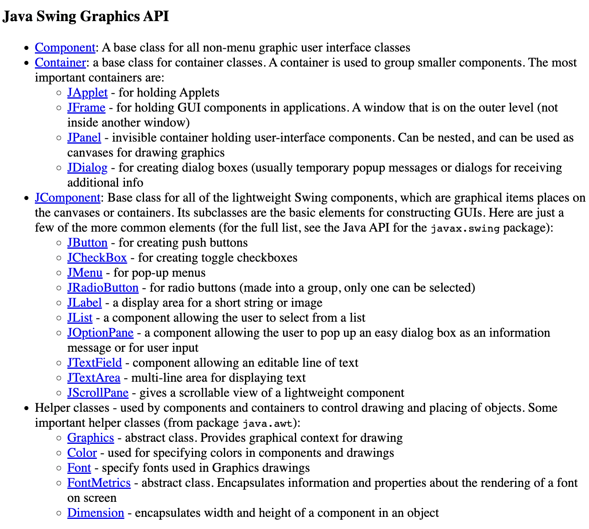

-
- # Introduction to Java Swing
  heading:: 1
  id:: 6351e376-9205-4db2-8703-b12a569720f7
	- Notes based on [ZetCode's introduction to Java Swing.](https://zetcode.com/javaswing/) and also [begginersbook](https://beginnersbook.com/2015/07/java-swing-tutorial/)
	- ## Java Swing & MVC:
	  heading:: 2
		- Java Swing is implemented with the ((63484d07-5ec4-4cf3-ba9b-543f737a6909)) design pattern.
			- This means the viewing (display), the business logic/control logic, and the persistant data (the model) are separated.
			- Information about Swing's MVC implementation can be found [here](https://www.oreilly.com/library/view/java-swing/156592455X/ch01s04.html#:~:text=Swing%20uses%20the%20model%2Dview,in%20how%20the%20component%20behaves.&text=The%20model%20encompasses%20the%20state%20data%20for%20each%20component.)
			- Each Swing Component implements MVC
				- 
		- ## Primary GUI Concepts:
		  heading:: 2
			- The main factors that make up a Graphic User Interface in a program are:
				- Components and Contaienrs
				- The layout of components on the screen (e.g. in a container, etc)
				- Event handling
			- Lot of components are pre-built, such as buttons ,text areas, slider bars, etc.
			- Some types of components are container, meaning they house groups of components.
				- Ball component can be handled by a BallContainer to handle multiple balls and their interactions.
			- Layouts refer to how components are render on the screen, etc, (position, size, etc,)
			- Event handling regers to setting up actions that can trigger fucntionality.
				- Examples:
					- Button clicks
					- selecting from a menu
					- pressing a key on the keyboard
					- timer expiring
					- etc
			- 
		- ### Event Handling:
		  heading:: 3
			- *event:* A single that something has happened in a program (eg button click)
			- Events are handled with event objects. These are trigged by actions on source objects (components or objects on which the event is generated) and they must implement corresponding event listener interfaces. This listener listens for the event, and evokes an event handler when event occurs.
				- `java.util.EventObject` base class for events in Java.
			- Example of event types:
				- 