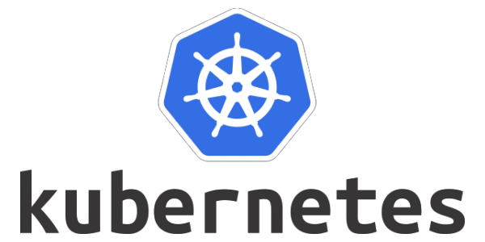
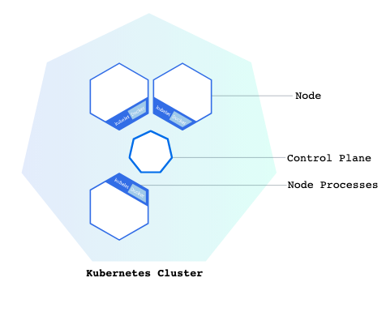

tags:: #[[Computer Science]] #[[Software Engineering]] #Containerization #[[Virtual Machines]]

- {:height 388, :width 759}
- # Guide to Kubernetes
	- tags:: #Docker
	- "With modern web services, users expect applications to be available 24/7, and developers expect to deploy new versions of those applications several times a day. Containerization helps package software to serve these goals, enabling applications to be released and updated without downtime. Kubernetes helps you make sure those containerized applications run where and when you want, and helps them find the resources and tools they need to work. Kubernetes is a production-ready, open source platform designed with Google's accumulated experience in container orchestration, combined with best-of-breed ideas from the community." via [Kubernetes.io](https://kubernetes.io/docs/tutorials/kubernetes-basics/)
		- Kubernetes essentially can be viewed as an extension of [[Docker]], allowing for easier control of containers.
	- The following notes are a guide to Kubernetes, with instructions on how to preform the most essential operations. These notes are heavily based on the official Kubernetes documentation.
	- ## Table of contents
		- ((6593c388-608f-477b-a814-81a0830cfe4d))
		- ((6593c47c-1df3-42a0-9a1b-d7a4dabb6d2e))
	- ## Using Minikube to create a cluster.
	  id:: 6593c388-608f-477b-a814-81a0830cfe4d
		- ### Kubernetes Clusters.
		  id:: 6593c47c-1df3-42a0-9a1b-d7a4dabb6d2e
			- A Kubernetes cluster consists of two types of resources:
				- **Control Plane**: coordinates the cluster. This is responsible for scheduling applications. maintaining applications' desired state, scaling applications, and rolling out updates.
				  logseq.order-list-type:: number
				- **Nodes**: the workers that run applications. A node is a
				  logseq.order-list-type:: number
				- A diagram of a cluster can be found below:
					- 
			-