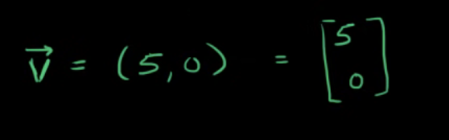
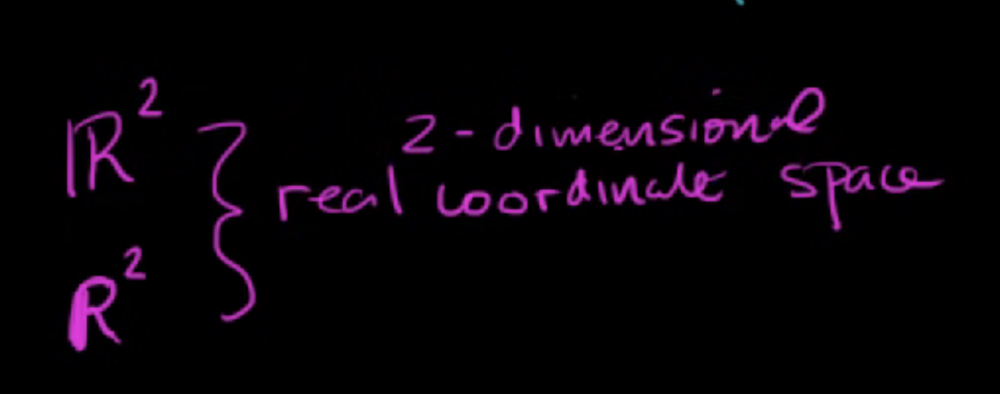
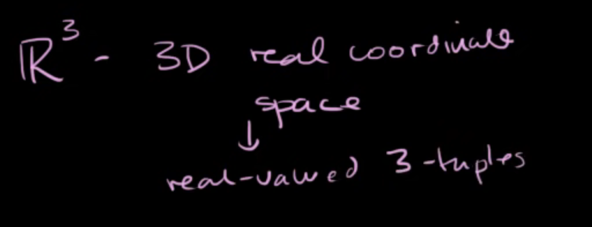

# Vectors and Space
	- ## Vectors
		- ### Introduction to Vectors:
		  video:: {{video https://youtu.be/br7tS1t2SFE}}
		  collapsed:: true
			- **Vector** has both `magnitude` and `direction`.
				- Speed is a scalar and east is a direction
					- when you have both of these you can get velocity a vector.
			- A lower case letter with an arrow on top is the math mathematical representation
				- 
		- ###  Real Coordinate Spaces
			- Real cordinate spaces are normally represenmted by R^x where x says how many dimensions we are working with:
				- 
					- This symbol also represents all possible real-valued 2-tuple.
				- Example of 3d real cordinate space
				  