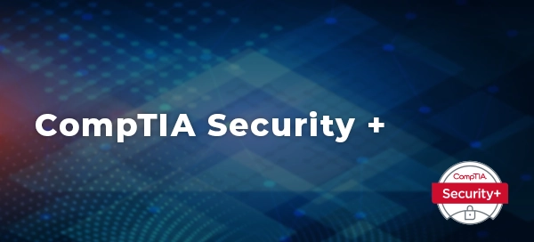
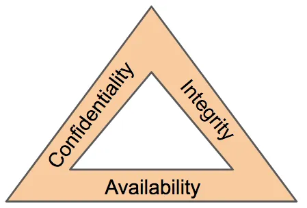
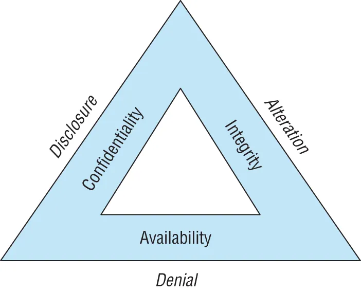

- {:height 338, :width 710}
- # CompTIA Security + Exam
  Created:: [[Jan 26th, 2024]] 
  Last-Revised:: [[Jan 26th, 2024]]
  tags:: #Graph/ISSUE/Grammar
	- ## Introduction to the Exam
	  collapsed:: true
		- The CompTIA Security+ Exam is created to be vendor-neutral for all cyber-security professionals. It is a good certificate for entering into the field.
		- The exam is recommended for those wishing to work as:
			- Systems administrators.
			- Security Administrators.
			- Security specialist.
			- Security Engineers.
			- Network Adminstrator.
			- Junior IT Auditor/Penetration tester
			- Security consultant.
		- The exam is a "performance -based assessment" , therefore it questions vary from multiple-choice, fill in the blank, multiple response, and interactive question formats, including image based questions.
		- The exam is timed, and you will be provided with 90 minutes to complete it. It features up to 90 questions, and is scored on a scale ranging from 100 to 900, with the passing score of 750.
	- ## 🧭 Key Topics / Table of Contents.
	  collapsed:: true
		- The exam is structured around 5 key domains:
			- Threats, Attacks, and Vulernabilities.
			  logseq.order-list-type:: number
			- Architecture and Design.
			  logseq.order-list-type:: number
			- Implementation.
			  logseq.order-list-type:: number
			- Operations and Incident Response.
			  logseq.order-list-type:: number
			- Governance, Risk, and Compliance.
			  logseq.order-list-type:: number
	- ## Recommended Resources
		- TODO add all the material used to create this page here.
	- ## Security and Threat models
	  collapsed:: true
		- ((65b5c362-a65b-4496-a9ed-e4e947d8d6e1)) and the ((65b700c9-b675-4d66-9c92-222d0e683681)) are both useful tools for cyber-security planning and risk analysis. They serve as helpful starting points when assessing security and threats.
			- For example, if you want to assess a risk of an organizatin, you may want to use ((65b700c9-b675-4d66-9c92-222d0e683681)).
			- ## The CIA Triad
			  id:: 65b5c362-a65b-4496-a9ed-e4e947d8d6e1
			  collapsed:: true
				- What does the **CIA Triad** stand for? #card
					- {{cloze Confidentiality, Integrity, availability of information.}}
				- Modern security professionals are responsible for protecting... #card
				  card-last-score:: 5
				  card-repeats:: 1
				  card-next-schedule:: 2024-01-30T18:20:02.676Z
				  card-last-interval:: 4
				  card-ease-factor:: 2.6
				  card-last-reviewed:: 2024-01-26T18:20:02.677Z
					- {{cloze confidentiality, integrity, and availability of information, commonly abbreviated to C.I.A}}
				- 
				-
				- #### Confidenitality
				  id:: 65b3fb5a-d2a5-44c3-831d-30c17a78d6b6
					- What is **Confidenitality?** #card
						- {{cloze Confidentiality ensures that unauthorized individuals are not able to gain access to sensitive information.}}
				- Hackers may try to undermine **confidentiality** controls to achieve one of their goals, the unauthorized disclosure of information, like with database breaches.
				- #### Integrity
					- What is **Integrity**? #card
						- {{cloze Integrity ensures that there are no unauthorized modifications to information or systems, either intentionally or unintentionally.}}
					- **Integrity** is usually implemented through various tools, like the use of hashes to verify if files are the same.
					- **Integrity** threats may come from attackers seeking the alteration of information without authorization or non-malicious sources, such as a power spike causing the corruption of information.
				- #### Avaliability
					- What is **Avaliability?** #card
						- {{cloze Avalibility ensures that the information and systems are ready to meet the needs of legitmate users at the time those users request them.}}
					- **Availability** is commonly seen through the use of fault tolerances , clustering, backups, etc.
					- Availability threats may come from either attackers seeking the disruption of access or non-malicious sources, such as natural disasters like fires, destroying datacenter that contain valuable information/services.
						-
				- Security incidents occur when an organization experiences a breach of the confidentiality, integrity, and/or availability of information.
				- Security professionals are responsible for understanding such risks and implementing appropriate designed controls to mitigate risks to an acceptable level.
			- ## The DAD Triad
			  id:: 65b700c9-b675-4d66-9c92-222d0e683681
			  collapsed:: true
				- The DAD triad is closely related to the ((65b5c362-a65b-4496-a9ed-e4e947d8d6e1)).
				- The main goal of the DAD triad is to... #card
					- {{cloze describe the three key threats to cybersecurity.}}
				- What does the **DAD Triad** stand for? #card
					- {{cloze Disclosure, Alteration, Denial.}}
				- {:height 387, :width 454}
				- #### Disclosure
				  collapsed:: true
					- What is **Disclosure**? #card
						- {{cloze disclosure is the exposure of sensitive information to unauthorized individuals, otherwise known as data loss.}}
					- What principle of the ((65b5c362-a65b-4496-a9ed-e4e947d8d6e1)) does **Disclosure** vioalte? #card
						- {{cloze Disclosure violates the principle of confidentiality. }}
					- Attackers who gain access to sensitive information and remove it from the organizations are said to be performing... #card
						- {{cloze data exfiltration.}}
				- #### Alteration
				  collapsed:: true
					- What is **Alteration**? #card
						- {{cloze Alteration is the unauthorized modification of information.}}
					- What principle of the ((65b5c362-a65b-4496-a9ed-e4e947d8d6e1)) does **Alteration** violate? #card
						- {{cloze It violates the principle of integrity.}}
					- Attackers may try to modify records in a system to obtain finical gain, such as fraud transactions.
					- Alteration can also occur to due natural faults, such as power outages when bits flips or when information isn't fully process at the time of the fault.
					- Accidental alteration is also a possibility, these occur via unintentional modification of information, such as with typos.
					- What are the three types of **alteration?** #card
						- {{cloze Malicious/Attackers}}
						  logseq.order-list-type:: number
						- {{cloze natural faults}}
						  logseq.order-list-type:: number
						- {{cloze accidental alteration, ie, typos.}}
						  logseq.order-list-type:: number
				- #### Denial
				  collapsed:: true
					- What is **Denial**? #card
						- {{cloze denial is the disruption of an authorized user's legitimate access to information.}}
					- What principle of the ((65b5c362-a65b-4496-a9ed-e4e947d8d6e1)) does **denial** violate? #card
						- {{cloze Denial events violate the principle of avaliability.}}
					- What are some examples of **denial** events? #card
						- {{cloze Distributed denial-of-service (DDoS) attacks}}
						  logseq.order-list-type:: number
						- {{cloze The failure of a critical server}}
						  logseq.order-list-type:: number
						- {{cloze Natural activity, such as natural disasters that impact a communication circuit.}}
						  logseq.order-list-type:: number
				-
			-
	- ## Breach Impact
		- The potential impact of a security incident is usually categories in terms of risk.
		- ### Types of Risk
			- What are the types of risk? #card
				- {{cloze Financial Risk}}
				  logseq.order-list-type:: number
				- {{cloze Reputational Risk}}
				  logseq.order-list-type:: number
				  id:: 65b7f7bb-1295-45ed-a75d-3cd0c21367ae
				- {{cloze Strategic Risk}}
				  logseq.order-list-type:: number
				- {{cloze Operational Risk}}
				  logseq.order-list-type:: number
				- {{cloze Compliance Risk.}}
				  logseq.order-list-type:: number
			- #### Financial Risk
				- The risk of monetary damages to the organization as a result of a data breach.
					- This could be **direct financial damage**, such as when you need to rebuild a data center after a natural disaster, or the cost of contracting experts for an incident response.
					- This could also be **indirect finical damage**. For example, when an employee loses a laptop containing future plans and there are no backup, the organization loses all the cost spent on research and development. They could be even more severe, such as when a competitor gets a hold of those plans and beats you to the market.
					- What are the two types of financial damage? #card
						- {{cloze Direct financial damage - When you have to pay to recover. }}
						  logseq.order-list-type:: number
						- {{cloze Indirect financial damage - when you lose out on revenue/investments lost. }}
						  logseq.order-list-type:: number
			- #### Reputational Risk
				- **Reputational risks** occur when the negative publicity surround a security breach causes the loss of goodwill among customers, employees, suppliers, and other stakeholders.
					- What is the most common impact in terms of a security breach affecting customers, employees, and other stakeholders? #card
						- {{cloze The risk of identity theft.}}
			- #### Strategic Risk
			  id:: 65b8004b-7ae0-463c-a6e1-ba85c1db193b
				- **Strategic Risk** is the risk that an organization will become less effective in meeting its major goals and objectives as a result of the breach.
					- An employee losing a laptop provides a strategic risk if that laptop contains the only copy of information, as this will delay development. It also poses a strategic risk because it gives your competitors time to make developments and get to market first.
			- #### Operational Risk
			  id:: 65b8094a-697c-467a-ad8e-4ff6dd04c087
				- **Operational Risk** is a risk to the organization's ability to carry out its day-to-day functions.
					- it may slow down daily operations.
					- Operational Risk and ((65b8004b-7ae0-463c-a6e1-ba85c1db193b)) are closely related.
						- How do you tell the difference between ((65b8094a-697c-467a-ad8e-4ff6dd04c087)) and ((65b8004b-7ae0-463c-a6e1-ba85c1db193b))? #card
							- {{cloze If a risk threatens the existence of an organization/ability of the organization to execute its business plan, that is a strategic risk.}}
							- {{cloze If the risk only causes inefficiency and delay within the organization, then it is an operational risk.}}
			- #### Compliance Risk
				- **Compliance risk** arises when a security breach leads an organization to violate legal or regulatory obligations.
				-
				-
				-