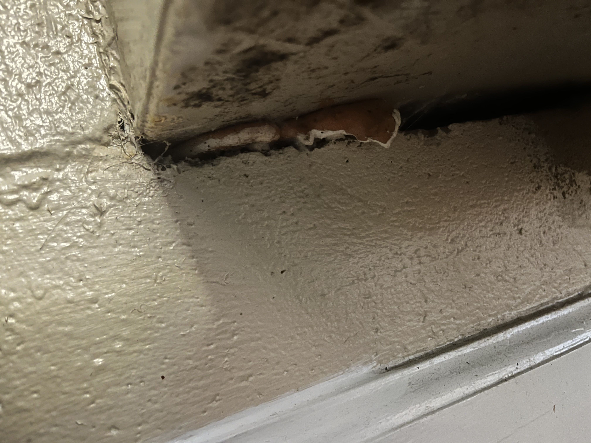

# **Re: Move In Condition Form.**
	- ## Location & Date:
		- 434 West Jefferson St
		- Tallahassee, Florida, 32301
		- May 16, 2024
	- ## Known Issues
		- ### Living Room
			- The AC Unit has the following issues:
				- Not properly circulating air throughout the apartment. (Bedroom has intense heat, even when windows blacked out.)
				  logseq.order-list-type:: number
				- **Fungal Presence**: The AC unit exhibits visible fungus growth at its base, and what appears to be black mold (uniformly spread unlike dust)
				  logseq.order-list-type:: number
					- 
					  logseq.order-list-type:: number
				- **Improper Sealing**: The unit is not adequately sealed from the outside environment. A sizable gap exists beneath the AC unit, providing easy access for rodents and other pests. 
				  logseq.order-list-type:: number
					- 
					  logseq.order-list-type:: number
				- **Vents dangerously moldy**:
				  logseq.order-list-type:: number